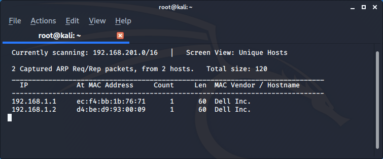
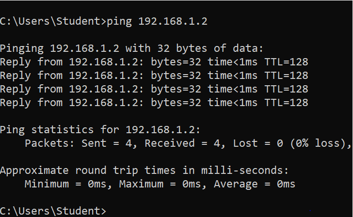

# ARP spoofing (MITM)

1. Goal
    * Intercept the communication between 2 devices in a switched network.

2. Used hardware
    * 1 laptop with Kali Linux
    * 2 devices (Computers, laptops, ...)

3. Used software
    * Kali Linux (2019.4)

4. Setup

5. Getting started
    1. Get an overview of your network (Kali Linux)
    
    

    

    The result shows us the client (192.168.1.1) and the server (192.168.1.2).

    2. Start the communication between the client and the server

    
    
    3. Look at the MAC address table of the client

    

    4. Start Wireshark (Kali Linux)

    

    The result shows us no ICMP-traffic destined for the server (192.168.1.2)

    5. Set IP forwarding (Kali Linux)
    
    IP forwarding allows an operating system to forward packets as a router does or more generally to route them through other networks.
    
    

    6. Launch the MITM attack (Kali Linux)

        1. Start Ettercap

        

        2. Select Sniff - Unified sniffing - eth0

        

        

        3. Select Hosts - Scan for hosts or you can add your targets manually

        

        

        4. Start the attack

        

        

    7. Verify if the attack is succesfull

    We are now capturing the traffic between the client and the server.

    

    The MAC-address table of the client is poissend. (192.168.1.10 is our Kali)

    

        

