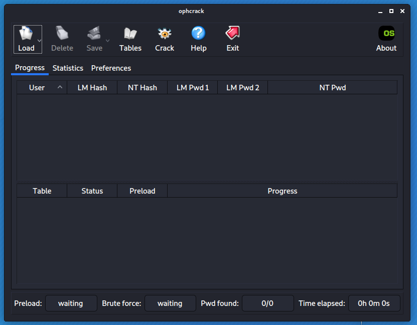

# Attack the SAM database

1. Goal
    * Recover the password of a user that uses Microsoft Windows as operating system.
    
2. Used hardware
    * 1 laptop with Kali Linux
    * 1 laptop with Microsoft Windows (user)  

3. Used software
    * Kali Linux (2020.1)
    * Microsoft Windows 10

4. Setup
    
    

5. Getting started

    1. Introduction

        The Security Account Manager (SAM) is a database file that stores users' passwords.

        [More information about Security Account Manager](https://en.wikipedia.org/wiki/Security_Account_Manager)

        There are 2 possible strategies:

            * The online attack
            The user didn't log off. So Microsoft Windows is still running.

            * The offline attack
            The hard disk of the user is in your possion.
             

    2. The online attack

        1. Download the tool PwDump8.
        
            [On your own responsibility!](http://blackmath.it/#Download)

        2. Run the tool (requires administrative privileges) on the laptop of the user.

            

        3. Retrieve the password.

            There are multiple websites available.

            
    
    3. The offline attack

        1. Attach the hard disk to Kali laptop.

            

        2. Start ophcrack.

            
        
        3. Select Load - Encrypted SAM.

            
        
        4. Check the result.

            

        5. Retrieve the password.

            There are multiple websites available.

            

6. Conclusion
    * Never leave your computer unattended!