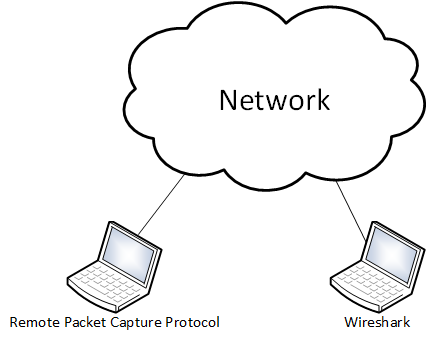
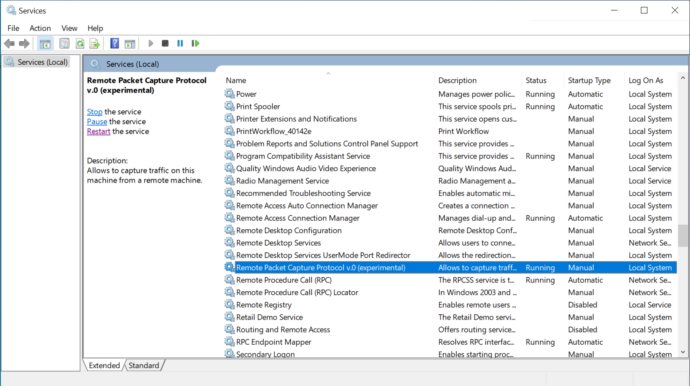
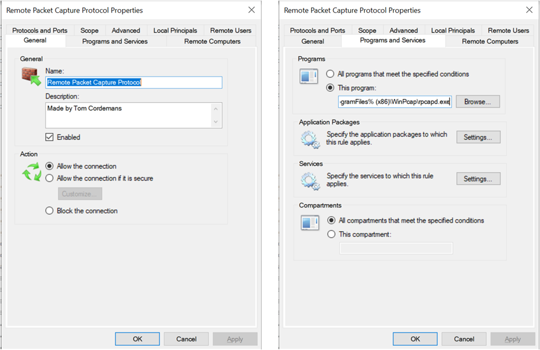
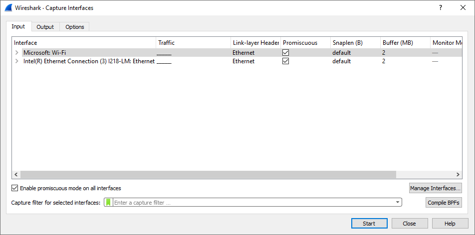
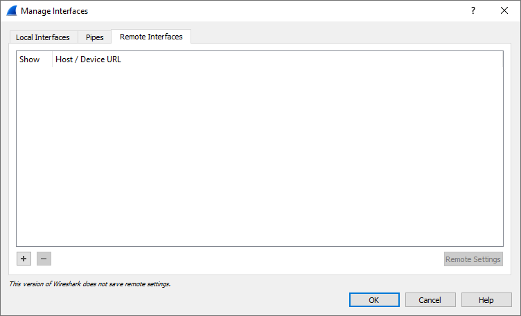
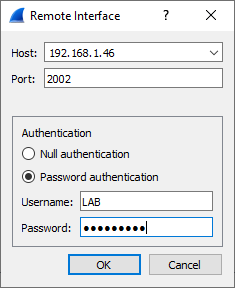
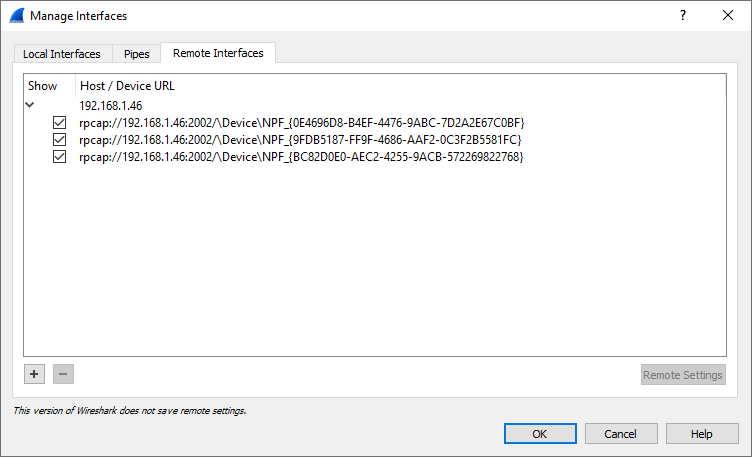
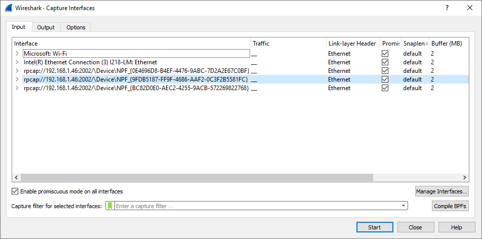
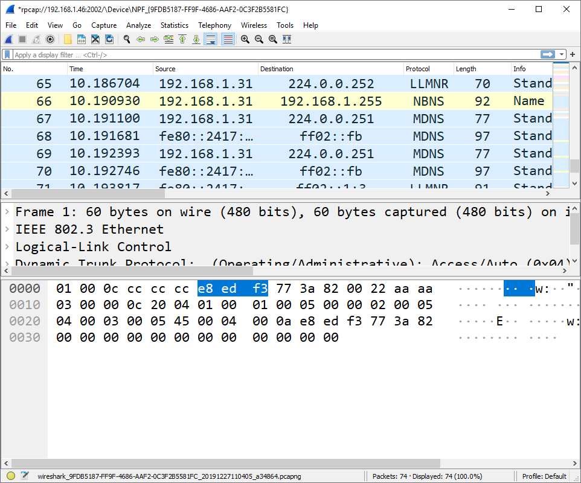

# Capture packets on a remote system

1. Goal
    * Wireshark captures traffic from your system’s local interfaces by default, but this isn’t always the location you want to capture from.
     
2. Used hardware
    * 2 laptops with Microsoft Windows

        Note: This feature is only available on Windows. Wireshark’s official documentation recommends that Linux users use an SSH tunnel.

3. Used software
    * Wireshark 3.2.0
    * WinPcap 4.1.3

4. Setup
    
    

5. Getting started
    
    1. Install WinPcap on the remote system.

    [More information about WinPcap](https://www.winpcap.org/)
    
    2. Start the Remote Packet Capture Protocol service on the remote system.

    

    3. Add a firewall rule to the host-based firewall of the remote system (if necessary).

    

    4. Open Wireshark on your local system and select "Capture" followed by "Options".

      
    
    5. Select "Manage Interfaces" followed by "Remote Interfaces".

    

    6. Select "+" and add the needed information.

    

    7. The following result appears. Confirm this window.

    

    8. Look for the right interface and start the capture.

    

    9. The result is a succesfull remote capture.

    
    
6. Conclusion
    
    Besides the regular capturing methods (SPAN, TAP, HUB,... ) this method also provides some possibilities.   
