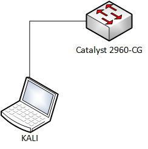

# CDP flooding

1. Goal
    * Saturize the CPU of a Cisco device.

2. Used hardware
    * 1 laptop with Kali Linux
    * 1 Cisco device

3. Used software
    * Kali Linux (2019.4)

4. Setup
    
    

5. Getting started
    1. Check if CDP (Cisco Discovery Protocol) is enabled on the Cisco device.
    ```
    Switch#show cdp
    Global CDP information:
        Sending CDP packets every 60 seconds
        Sending a holdtime value of 180 seconds
        Sending CDPv2 advertisements is enabled
    Switch#
    ````
    


