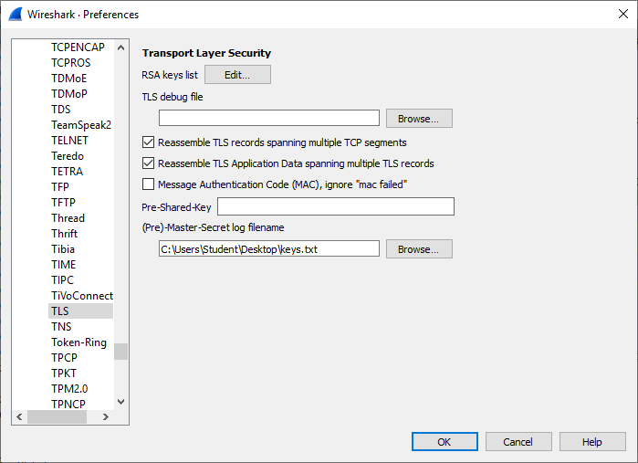

# Decryption of TLS sessions

1. Goal
    * Using Wireshark to decrypt (HTTPS) web traffic.
     
2. Used hardware
    * 1 laptop with Microsoft Windows

3. Used software
    * Wireshark 3.2.1
    * Firefox or Chrome

4. Setup
    
    

5. Getting started
    
    1. Set the environment variable SSLKEYLOGFILE.

    [More information about TLS](https://en.wikipedia.org/wiki/Transport_Layer_Security)

    We will use Windows Powershell to complete this task.
    
    ```powershell
    $env:SSLKEYLOGFILE "C:\Users\Student\Desktop\keys.txt"
    
    Get-ChildItem env:SSLKEYLOGFILE
    Name                           Value
    ----                           -----
    SSLKEYLOGFILE                  C:\Users\Student\Desktop\keys.txt
    ```
    
    2. Create the file keys.txt on the correct location.

    We will use Windows Powershell to complete this task.
    
    ```powershell
    New-Item C:\Users\Student\Desktop\keys.txt
    ```
    3. Reboot your system.

    4. Start Wireshark and capture traffic.

    

    5. Open Firefox and go to a website.

      
    
    6. Stop the capture and look for the correct session.

    First, we look for frames that are containing the word "wireshark".

    

    Afterwards, we select the correct stream.

    

    This stream is still encrypted.

    

    7. Configure the key log file in Wireshark.

    

    8. Look at the result. (TLS decrypted).

    
   
6. Conclusion
    * Once Wireshark and your environment are set up properly, it is a piece of cake to view decrypted data.   
