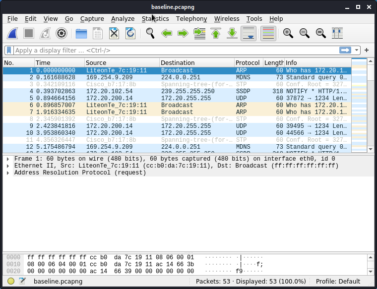

# Steganography

1. Goal
    * Hide (confidential) data to bypass Data Loss Prevention.

2. Used hardware
    * 1 laptop with Kali Linux

3. Used software
    * Kali Linux (2020.2)

4. Setup
    
    

5. Getting started

    1. Steganography is the practice of concealing a file, message, image, or video within another file, message, image, or video.

    We will use CloakifyFactory as an example.
    
    [More information about CloakifyFactory](https://github.com/TryCatchHCF/Cloakify).

    2. Download and extract the ZIP file.

    ```bash
    kali@kali:~/Desktop/Cloakify-master$ ls -Al
    total 76
    drwx------ 2 kali kali  4096 May 27 17:03 ciphers
    -rw-r--r-- 1 kali kali 17465 May 27 17:03 cloakifyFactory.py
    -rw-r--r-- 1 kali kali  3019 May 27 17:03 cloakify.py
    -rw-r--r-- 1 kali kali  2079 May 27 17:03 decloakify.py
    drwx------ 2 kali kali  4096 May 27 17:03 DefCon24Slides
    -rw-r--r-- 1 kali kali  1078 May 27 17:03 LICENSE
    drwx------ 2 kali kali  4096 May 27 17:03 listsUnrandomized
    drwx------ 2 kali kali  4096 May 27 17:03 noiseTools
    -rw-r--r-- 1 kali kali   492 May 27 17:03 randomizeCipherExample.txt
    -rw-r--r-- 1 kali kali  5641 May 27 17:03 README_GETTING_STARTED.txt
    -rw-r--r-- 1 kali kali  6791 May 27 17:03 README.md
    -rw-r--r-- 1 kali kali   849 May 27 17:03 removeNoise.py
    drwx------ 2 kali kali  4096 May 27 17:03 screenshots
    kali@kali:~/Desktop/Cloakify-master$ 
    ```

    3. Make the Python scripts executable
    
    ```bash
    kali@kali:~/Desktop/Cloakify-master$ chmod +x *.py
    kali@kali:~/Desktop/Cloakify-master$ ls -Al
    total 76
    drwx------ 2 kali kali  4096 May 27 17:03 ciphers
    -rwxr-xr-x 1 kali kali 17465 May 27 17:03 cloakifyFactory.py
    -rwxr-xr-x 1 kali kali  3019 May 27 17:03 cloakify.py
    -rwxr-xr-x 1 kali kali  2079 May 27 17:03 decloakify.py
    drwx------ 2 kali kali  4096 May 27 17:03 DefCon24Slides
    -rw-r--r-- 1 kali kali  1078 May 27 17:03 LICENSE
    drwx------ 2 kali kali  4096 May 27 17:03 listsUnrandomized
    drwx------ 2 kali kali  4096 May 27 17:03 noiseTools
    -rw-r--r-- 1 kali kali   492 May 27 17:03 randomizeCipherExample.txt
    -rw-r--r-- 1 kali kali  5641 May 27 17:03 README_GETTING_STARTED.txt
    -rw-r--r-- 1 kali kali  6791 May 27 17:03 README.md
    -rwxr-xr-x 1 kali kali   849 May 27 17:03 removeNoise.py
    drwx------ 2 kali kali  4096 May 27 17:03 screenshots
    kali@kali:~/Desktop/Cloakify-master$ cd noiseTools/
    kali@kali:~/Desktop/Cloakify-master/noiseTools$ chmod +x *.py
    kali@kali:~/Desktop/Cloakify-master/noiseTools$ ls -Al
    total 16
    -rwxr-xr-x 1 kali kali 1261 May 27 17:03 prependEmoji.py
    -rwxr-xr-x 1 kali kali 1546 May 27 17:03 prependID.py
    -rwxr-xr-x 1 kali kali 1935 May 27 17:03 prependLatLonCoords.py
    -rwxr-xr-x 1 kali kali 2515 May 27 17:03 prependTimestamps.py
    kali@kali:~/Desktop/Cloakify-master/noiseTools$ cd ..
    kali@kali:~/Desktop/Cloakify-master$ 

    ```
    4. Start the tool.

    ```bash
    kali@kali:~/Desktop/Cloakify-master$ sudo python cloakifyFactory.py 
    [sudo] password for kali: 
      ____ _             _    _  __        ______         _                   
     / __ \ |           | |  |_|/ _|       |  ___|       | |                  
    | /  \/ | ___   __ _| | ___| |_ _   _  | |_ __ _  ___| |_ ___  _ __ _   _ 
    | |   | |/ _ \ / _` | |/ / |  _| | | | |  _/ _` |/ __| __/ _ \| '__| | | |
    | \__/\ | |_| | |_| |   <| | | | |_| | | || |_| | |__| || |_| | |  | |_| |
    \____/_|\___/ \__,_|_|\_\_|_|  \__, | \_| \__,_|\___|\__\___/|_|   \__, |
                                    __/ |                               __/ |
                                    |___/                               |___/ 

                "Hide & Exfiltrate Any Filetype in Plain Sight"

                            Written by TryCatchHCF
                        https://github.com/TryCatchHCF
    (\~---.
    /   (\-`-/)
    (      ' '  )         data.xls image.jpg  \     List of emoji, IP addresses,
    \ (  \_Y_/\    ImADolphin.exe backup.zip  -->  sports teams, desserts,
     ""\ \___//         LoadMe.war file.doc  /     beers, anything you imagine
        `w   "

    ====  Cloakify Factory Main Menu  ====

    1) Cloakify a File
    2) Decloakify a File
    3) Browse Ciphers
    4) Browse Noise Generators
    5) Help / Basic Usage
    6) About Cloakify Factory
    7) Exit

    Selection: 

    
    ``` 
    5. Type 5 to view the help for this tool.

    ```
    =====================  Using Cloakify Factory  =====================

    For background and full tutorial, see the presentation slides at
    https://github.com/TryCatchHCF/Cloakify

    WHAT IT DOES:

    Cloakify Factory transforms any filetype (e.g. .zip, .exe, .xls, etc.) into
    a list of harmless-looking strings. This lets you hide the file in plain sight,
    and transfer the file without triggering alerts. The fancy term for this is
    'text-based steganography', hiding data by making it look like other data.

    For example, you can transform a .zip file into a list made of Pokemon creatures
    or Top 100 Websites. You then transfer the cloaked file however you choose,
    and then decloak the exfiltrated file back into its original form. The ciphers
    are designed to appear like harmless / ignorable lists, though some (like MD5
    password hashes) are specifically meant as distracting bait.

    BASIC USE:

    Cloakify Factory will guide you through each step. Follow the prompts and
    it will show you the way.

    Cloakify a Payload:
    - Select 'Cloakify a File' (any filetype will work - zip, binaries, etc.)
    - Enter filename that you want to Cloakify (can be filename or filepath)
    - Enter filename that you want to save the cloaked file as
    - Select the cipher you want to use
    - Select a Noise Generator if desired
    - Preview cloaked file if you want to check the results
    - Transfer cloaked file via whatever method you prefer

    Decloakify a Payload:
    - Receive cloaked file via whatever method you prefer
    - Select 'Decloakify a File'
    - Enter filename of cloaked file (can be filename or filepath)
    - Enter filename to save decloaked file to
    - Preview cloaked file to review which Noise Generator and Cipher you used
    - If Noise Generator was used, select matching Generator to remove noise
    - Select the cipher used to cloak the file
    - Your decloaked file is ready to go!

    You can browse the ciphers and outputs of the Noise Generators to get
    an idea of how to cloak files for your own needs.

    Anyone using the same cipher can decloak your cloaked file, but you can
    randomize (scramble) the preinstalled ciphers. See 'randomizeCipherExample.txt'
    in the Cloakify directory for an example.

    NOTE: Cloakify is not a secure encryption scheme. It's vulnerable to
    frequency analysis attacks. Use the 'Add Noise' option to add entropy when
    cloaking a payload to help degrade frequency analysis attacks. Be sure to
    encrypt the file prior to cloaking if secrecy is needed.

    ====  Cloakify Factory Main Menu  ====

    1) Cloakify a File
    2) Decloakify a File
    3) Browse Ciphers
    4) Browse Noise Generators
    5) Help / Basic Usage
    6) About Cloakify Factory
    7) Exit

    Selection: 
    ```
    6. In this example the file "secret-basline.pcapng" will be hidden.

    We also use the noise option to add entropy when cloaking a payload to help degrade frequency analysis attacks. 

    ```
    Selection: 1

    ====  Cloakify a File  ====

    Enter filename to cloak (e.g. ImADolphin.exe or /foo/bar.zip): /home/kali/Desktop/secret-baseline.pcapng

    Save cloaked data to filename (default: 'tempList.txt'): /home/kali/Desktop/Mybeers.txt

    Ciphers:

    1 - hashesMD5
    2 - amphibians
    3 - pokemonGo
    4 - dessertsArabic
    5 - worldFootballTeams
    6 - evadeAV
    7 - dessertsHindi
    8 - statusCodes
    9 - rickrollYoutube
    10 - starTrek
    11 - dessertsPersian
    12 - topWebsites
    13 - dessertsRussian
    14 - belgianBeers
    15 - dessertsChinese
    16 - desserts
    17 - geoCoordsWorldCapitals
    18 - geocache
    19 - ipAddressesTop100
    20 - emoji
    21 - skiResorts
    22 - dessertsThai
    23 - worldBeaches
    24 - dessertsSwedishChef

    Enter cipher #: 14

    Add noise to cloaked file? (y/n): y

    Noise Generators:

    1 - prependEmoji.py
    2 - prependLatLonCoords.py
    3 - prependTimestamps.py
    4 - prependID.py

    Enter noise generator #: 4

    Creating cloaked file using cipher: belgianBeers
    Adding noise to cloaked file using noise generator: prependID.py

    Cloaked file saved to: /home/kali/Desktop/Mybeers.txt

    Preview cloaked file? (y/n): y

    Tag: KIe9 Chimay Wit
    Tag: YTgE Floris Framboise
    Tag: 2xLZ 't Smisje Calva Reserva
    Tag: f2Ix Saison de Dottignies
    Tag: 7MSW Chimay Wit
    Tag: AGPn Molse Tripel
    Tag: GAcX Floris Framboise
    Tag: XwoP Sint-Gummarus Tripel
    Tag: jFJw Sint-Gummarus Tripel
    Tag: lAJd Sint-Gummarus Tripel
    Tag: cjIi Steendonk
    Tag: 1PDP Saison de Dottignies
    Tag: MeyS Pikkeling Tripel
    Tag: DGok Chimay Wit
    Tag: SAth Geuze Mariage Parfait
    Tag: itmt Nondedju
    Tag: AOZh Sint-Gummarus Tripel
    Tag: vDJx Den Twaalf
    Tag: s3oq Sint-Gummarus Tripel
    Tag: thSB Sint-Gummarus Tripel

    Press return to continue... 

    ====  Cloakify Factory Main Menu  ====

    1) Cloakify a File
    2) Decloakify a File
    3) Browse Ciphers
    4) Browse Noise Generators
    5) Help / Basic Usage
    6) About Cloakify Factory
    7) Exit

    Selection: 
    ``` 
    7. Read the file "Mybeers.txt"

    ```
    kali@kali:~/Desktop/Cloakify-master$ cd ..
    kali@kali:~/Desktop$ cat Mybeers.txt | more
    Tag: KIe9 Chimay Wit
    Tag: YTgE Floris Framboise
    Tag: 2xLZ 't Smisje Calva Reserva
    Tag: f2Ix Saison de Dottignies
    Tag: 7MSW Chimay Wit
    Tag: AGPn Molse Tripel
    Tag: GAcX Floris Framboise
    Tag: XwoP Sint-Gummarus Tripel
    Tag: jFJw Sint-Gummarus Tripel
    Tag: lAJd Sint-Gummarus Tripel
    Tag: cjIi Steendonk
    Tag: 1PDP Saison de Dottignies
    Tag: MeyS Pikkeling Tripel
    Tag: DGok Chimay Wit
    Tag: SAth Geuze Mariage Parfait
    Tag: itmt Nondedju
    Tag: AOZh Sint-Gummarus Tripel
    Tag: vDJx Den Twaalf
    Tag: s3oq Sint-Gummarus Tripel
    Tag: thSB Sint-Gummarus Tripel
    Tag: aLLB Sint-Gummarus Tripel
    Tag: eAjV Pikkeling Tripel
    Tag: UP8Y Vossen met de Meynen Blond
    Tag: xS7c Vossen met de Meynen Blond
    Tag: tGjY Vossen met de Meynen Blond
    Tag: tUBP Vossen met de Meynen Blond
    Tag: Bx8i Vossen met de Meynen Blond
    Tag: c2zq Vossen met de Meynen Blond
    Tag: VuJQ Vossen met de Meynen Blond
    Tag: Jj3Q Vossen met de Meynen Blond
    Tag: EPXs Vossen met de Meynen Blond
    Tag: FpPt Vossen met de Meynen Blond
    Tag: 9hfh Sint-Gummarus Tripel
    Tag: 7Tjf Floris Framboise
    Tag: DjoY Sint-Gummarus Tripel
    Tag: 1n5J Holger
    Tag: CVK7 Sint-Gummarus Tripel
    Tag: ovLk Liefmans Frambozenbier
    Tag: YQ2E Morpheus Tripel
    Tag: 20pn Limerick
    Tag: 0kXk La Namuroise
    Tag: V8fS Ypres
    Tag: 6RSh La Rulles Blonde
    Tag: FN6A Geuze Mariage Parfait
    Tag: OluB Hoppe
    Tag: f0Af Louwaege Faro
    Tag: aIhF Affligem 950 Cuvee
    Tag: pNgk Waterloo Tripel 7 Blond
    Tag: bTAf Affligem 950 Cuvee
    Tag: TOQ7 Liefmans Frambozenbier
    Tag: UGy5 Saison de Dottignies
    Tag: vj89 Buffalo Bitter
    Tag: JR3v Lesage Dubbel

    kali@kali:~/Desktop$ 
    ``` 
    8. Unhide the file "secret-basline.pcapng"

    ```
    kali@kali:~/Desktop/Cloakify-master$ sudo python cloakifyFactory.py 
    [sudo] password for kali: 
      ____ _             _    _  __        ______         _                   
     / __ \ |           | |  |_|/ _|       |  ___|       | |                  
    | /  \/ | ___   __ _| | ___| |_ _   _  | |_ __ _  ___| |_ ___  _ __ _   _ 
    | |   | |/ _ \ / _` | |/ / |  _| | | | |  _/ _` |/ __| __/ _ \| '__| | | |
    | \__/\ | |_| | |_| |   <| | | | |_| | | || |_| | |__| || |_| | |  | |_| |
    \____/_|\___/ \__,_|_|\_\_|_|  \__, | \_| \__,_|\___|\__\___/|_|   \__, |
                                    __/ |                               __/ |
                                    |___/                               |___/ 

                "Hide & Exfiltrate Any Filetype in Plain Sight"

                            Written by TryCatchHCF
                        https://github.com/TryCatchHCF
    (\~---.
    /   (\-`-/)
    (      ' '  )         data.xls image.jpg  \     List of emoji, IP addresses,
    \ (  \_Y_/\    ImADolphin.exe backup.zip  -->  sports teams, desserts,
     ""\ \___//         LoadMe.war file.doc  /     beers, anything you imagine
        `w   "

    ====  Cloakify Factory Main Menu  ====

    1) Cloakify a File
    2) Decloakify a File
    3) Browse Ciphers
    4) Browse Noise Generators
    5) Help / Basic Usage
    6) About Cloakify Factory
    7) Exit

    Selection: 2

    ====  Decloakify a Cloaked File  ====

    Enter filename to decloakify (e.g. /foo/bar/MyBoringList.txt): /home/kali/Desktop/Mybeers.txt

    Save decloaked data to filename (default: 'decloaked.file'): /home/kali/Desktop/baseline.pcapng       

    Preview cloaked file? (y/n default=n): y

    Tag: KIe9 Chimay Wit
    Tag: YTgE Floris Framboise
    Tag: 2xLZ 't Smisje Calva Reserva
    Tag: f2Ix Saison de Dottignies
    Tag: 7MSW Chimay Wit
    Tag: AGPn Molse Tripel
    Tag: GAcX Floris Framboise
    Tag: XwoP Sint-Gummarus Tripel
    Tag: jFJw Sint-Gummarus Tripel
    Tag: lAJd Sint-Gummarus Tripel
    Tag: cjIi Steendonk
    Tag: 1PDP Saison de Dottignies
    Tag: MeyS Pikkeling Tripel
    Tag: DGok Chimay Wit
    Tag: SAth Geuze Mariage Parfait
    Tag: itmt Nondedju
    Tag: AOZh Sint-Gummarus Tripel
    Tag: vDJx Den Twaalf
    Tag: s3oq Sint-Gummarus Tripel
    Tag: thSB Sint-Gummarus Tripel

    Was noise added to the cloaked file? (y/n default=n): y

    Noise Generators:

    1 - prependEmoji.py
    2 - prependLatLonCoords.py
    3 - prependTimestamps.py
    4 - prependID.py

    Enter noise generator #: 4
    Removing noise from noise generator: prependID.py

    Ciphers:

    1 - hashesMD5
    2 - amphibians
    3 - pokemonGo
    4 - dessertsArabic
    5 - worldFootballTeams
    6 - evadeAV
    7 - dessertsHindi
    8 - statusCodes
    9 - rickrollYoutube
    10 - starTrek
    11 - dessertsPersian
    12 - topWebsites
    13 - dessertsRussian
    14 - belgianBeers
    15 - dessertsChinese
    16 - desserts
    17 - geoCoordsWorldCapitals
    18 - geocache
    19 - ipAddressesTop100
    20 - emoji
    21 - skiResorts
    22 - dessertsThai
    23 - worldBeaches
    24 - dessertsSwedishChef

    Enter cipher #: 14

    Decloaking file using cipher:  belgianBeers

    Decloaked file decloakTempFile.txt , saved to /home/kali/Desktop/baseline.pcapng
    Press return to continue... 

    ====  Cloakify Factory Main Menu  ====

    1) Cloakify a File
    2) Decloakify a File
    3) Browse Ciphers
    4) Browse Noise Generators
    5) Help / Basic Usage
    6) About Cloakify Factory
    7) Exit

    Selection: 

    ```
    8. Open the file "basline.pcapng" in Wireshark.

     
    

6. Conclusion

    *  This tool is very useful in bypassing Data Loss Prevention (DLP) and antivirus detection.
