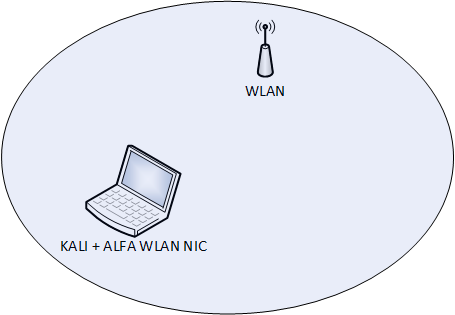
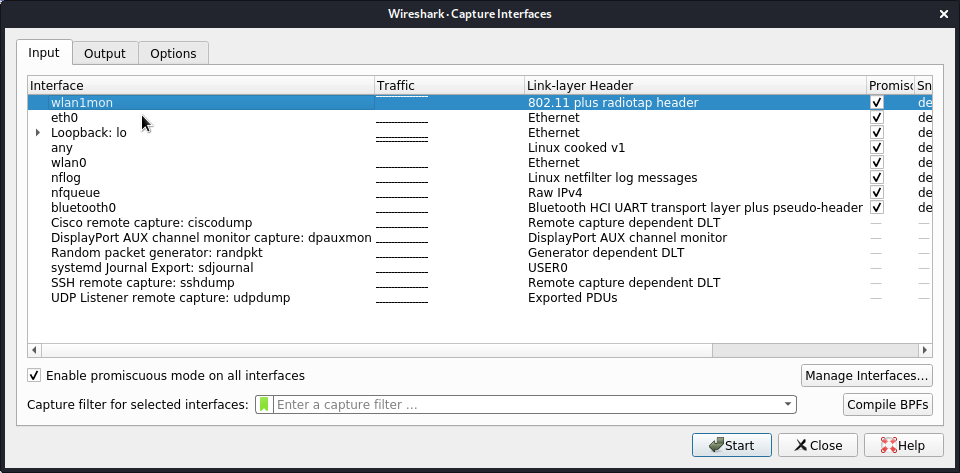
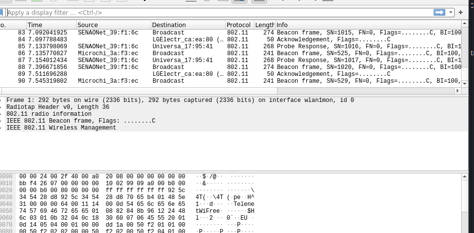
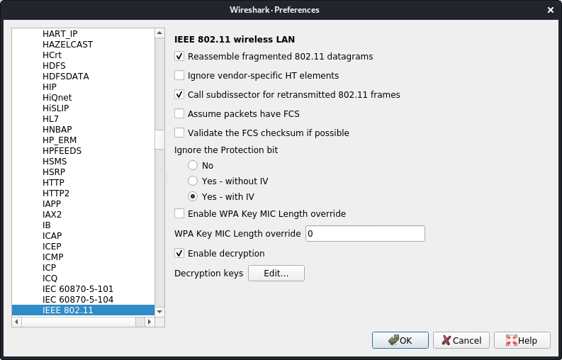
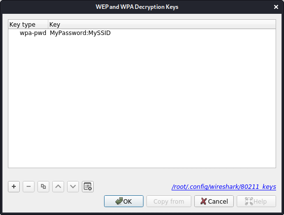
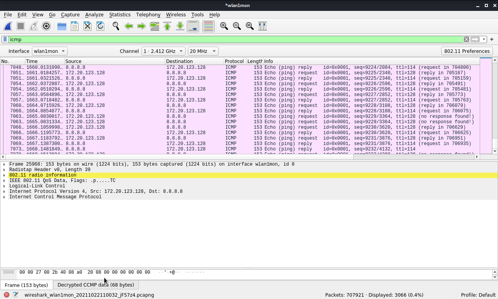

# Wireless capturing

1. Goal
    * Capture, analyze and decrypt wireless traffic.

2. Used hardware
    * Alfa AWUS036NHA (Long-range USB Adapter)
    * 1 laptop with Kali Linux
    
3. Used software
    * Kali Linux (2020.1)

4. Setup



5. Getting started

    1. Display the list of available adapters. (Kali Linux)
    
    ```
    kali@kali:~# sudo airmon-ng

    PHY	Interface	Driver		Chipset

    phy0	wlan0		iwlwifi		Intel Corporation Centrino Advanced-N 6205 [Taylor Peak] (rev 34)
    phy1	wlan1		ath9k_htc	Qualcomm Atheros Communications AR9271 802.11n
    
    kali@kali:~#
    ```
    
    2. Monitor mode allows a wireless network interface controller to monitor all traffic received on a wireless channel.

        1. Kill the network managers. (To Avoid interference with other tools)
        
        ```
        kali@kali:~# sudo airmon-ng check kill

        Killing these processes:

        PID Name
        643 wpa_supplicant

        kali@kali:~#
        ```
        
        2. Put the adapter in monitor mode.
        
        ```
        kali@kali:~# sudo airmon-ng start wlan1

        PHY	Interface	Driver		Chipset

        phy0	wlan0		iwlwifi		Intel Corporation Centrino Advanced-N 6205 [Taylor Peak] (rev 34)
        phy1	wlan1		ath9k_htc	Qualcomm Atheros Communications AR9271 802.11n

		                (mac80211 monitor mode vif enabled for [phy1]wlan1 on [phy1]wlan1mon)
		                (mac80211 station mode vif disabled for [phy1]wlan1)

        kali@kali:~#
        
        ```
    3. Start Wireshark and select the wlan1mon interface.
    
    ```
    kali@kali:~# sudo wireshark 
    ```
    

    4. Check the result.

    

    5. Decrypt wireless traffic in Wireshark.

        1. Go to Edit -> Preferences -> Protocols -> IEEE 802.11.
        

        2. Click on the "Edit..." button next to "Decryption Keys" to add keys.
        

        3. Check the decrypted wireless traffic
        
        [More information about decrypting IEEE 802.11](https://gitlab.com/wireshark/wireshark/-/wikis/HowToDecrypt802.11)

6. Conclusion
    * It is perfectly possible to capture wireless networks cheaply.

    
