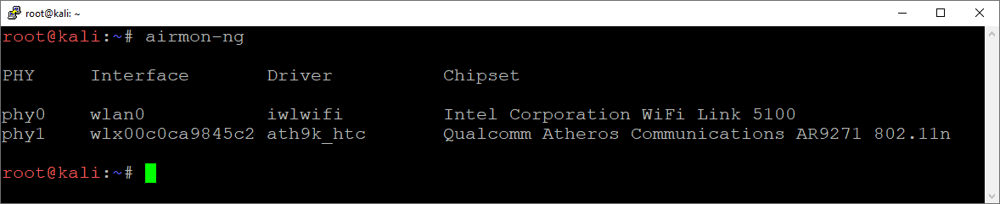

# Wireless sniffing

1. Goal
    1. Collect and analyze wireless traffic.

2. Used hardware
    1. Alfa AWUS036NHA (Long-range USB Adapter)
    2. TL-MR3020 (Porable 3G/4G Wireless N Router)
    3. 1 laptop with Kali Linux
    4. 1 device with a wireless connection (Smartphone, tablet, ...)

3. Used software
    1. Kali Linux (2019.4)

4. Setup

5. Getting started
    1. Display the list of available adapters (Kali Linux)
    
    

Monitor mode allows a wireless network interface controller to monitor all traffic received on a wireless channel.
