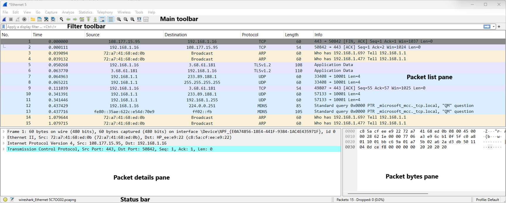
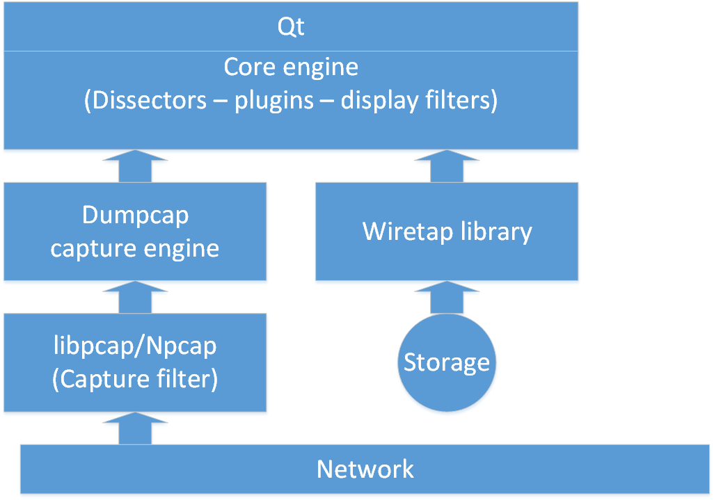

# Under construction (My goal for 2025)

This course introduces you to the fundamental skills needed to use Wireshark effectively. It covers the most commonly used protocols and explores a variety of intriguing problems. To enhance your learning experience, the course incorporates practical exercises to share as much expertise as possible.   

## Introduction
    
1. What is Wireshark

Wireshark is an application known as a "packet sniffer" and "protocol analyzer," designed to capture and analyze data on a network. It is a the successor of the once widely used Ethereal. The functionality of Wireshark is somewhat similar to the [tcpdump](https://www.tcpdump.org/) tool, but it provides a GUI and additional functionality for sorting, filtering and visualising data.   

The figure below shows the main window of Wireshark with the differtent toolbars and panes.   

Wireshark enables users to monitor data transmitted over a network by setting the network card to promiscuous mode. This mode allows the network card to process all incoming frames, not just those specifically addressed to it.  

Beyond merely displaying network traffic, Wireshark has the capability to interpret the structure of numerous network protocols. This enables the software to present the various nested protocols and reveal the contents of each field in detail.   

Wireshark is available under an open-source license and is compatible with multiple platforms, including Windows, Unix, Unix-like systems such as Linux, and macOS. It utilizes Npcap/libpcap to capture network traffic.   

* **Qt** provides a platform independent graphical user interface for Wireshark.   
* The **Core engine** supports thousands of dissectors and puts everything in a readable format.   
* The **Dumpcap capture engine** determines how the capture process starts and stops.   
* The **libpcap/Npcap** is a specific driver that takes the frames from the network and offers them to the **Dumpcap capture engine**.   
* When you open a saved pcapng file in Wireshark, you use the **Wiretap library** to offer the saved frames to the **Core engine**.   

2. When to use Wireshark?

Wireshark provides visibility into the traffic's source, destination, and timing, but it doesn't explain the reasons behind the traffic. Therefore, it's essential to review the application and operating system logs and debug information.   

Wireshark, on the other hand, can guide you on where to focus your investigation. For many "black box" network devices with limited or nonexistent interfaces, Wireshark often becomes the primary troubleshooting tool.   

Some of the most notable uses of Wireshark include:

* Network traffic analysis (e.g., identifying top talkers)
* Troubleshooting issues (e.g., diagnosing slow network performance)
* Security investigations (e.g., detecting suspicious hosts)
* Application analysis (e.g., bandwidth consumption)

3. First exploration

## Getting Wireshark ready

## How and where to capture

## Using display filters

## Tables and graphs

## Extract data out of network traffic

## Straight from practice

## Wireless LAN

## Nice to know

## Other sources